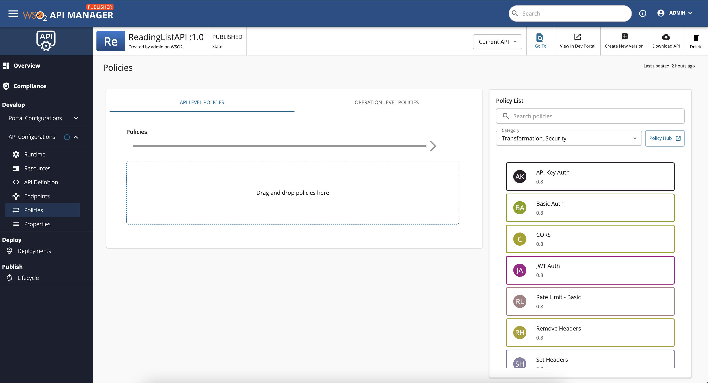
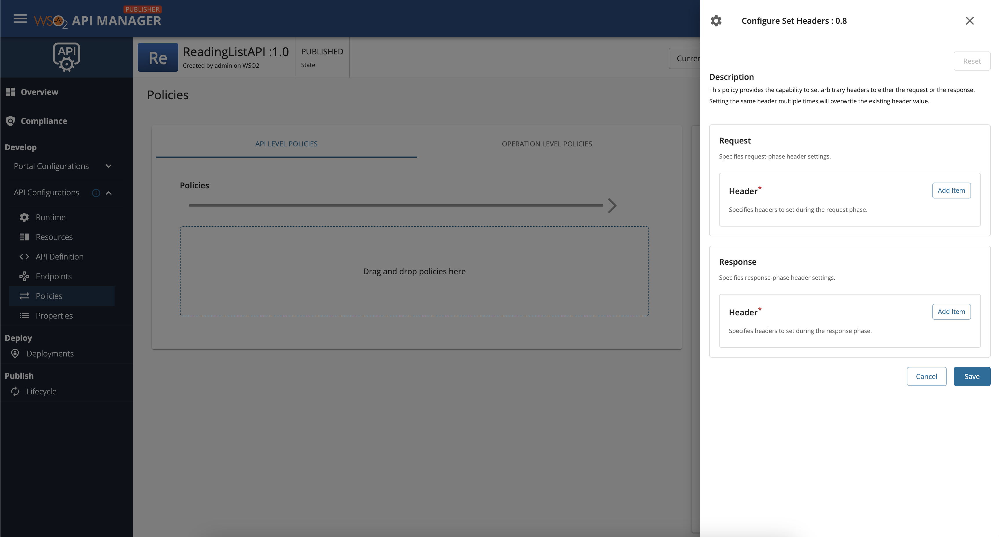
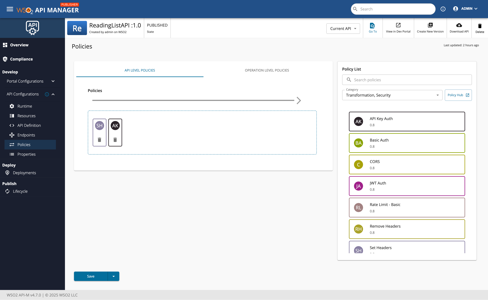

# Adding and Managing Policies

This guide explains how to add and manage policies for APIs deployed to API Platform Gateway.

## Overview

Policies allow you to enforce security, traffic control, transformations, and other governance requirements on your APIs.

For APIs deployed to API Platform Gateway, policies are currently sourced from Policy Hub and configured in the API Publisher.

You can apply policies by dragging them to the policy canvas and then configuring each policy to run in the request flow or response flow, based on your API behavior requirements.

## Add policies to an API

To add policies to an API deployed to API Platform Gateway:

1. Sign in to the **Publisher Portal**.
2. Open the API that is deployed (or will be deployed) to **API Platform Gateway**.
3. Go to **Develop** -> **Policies**.

    

4. Drag and drop the required policy from the available policies list to the policy canvas.
5. Configure the policy parameters.

    In the policy configuration, choose how the policy should behave in the **Request** flow or **Response** flow.

    

6. Save the API and deploy the updated revision to API Platform Gateway.

    

## Available policy types

See [Policy Hub](https://wso2.com/api-platform/policy-hub) for available policies.

## What's next

- Return to [Getting Started]({{base_path}}/api-gateway/api-platform-gateway/getting-started/) to test API invocation with and without API-key-based authentication.
