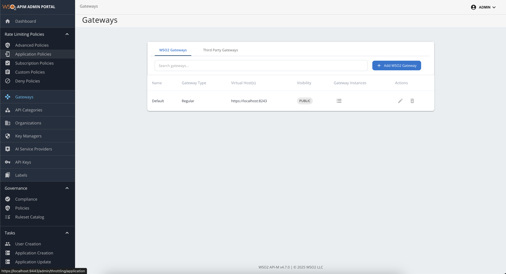
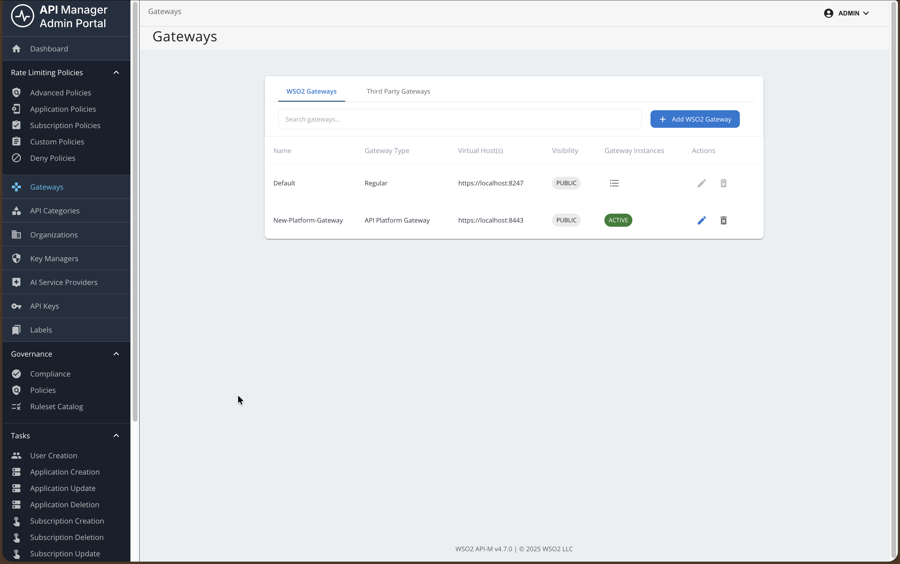
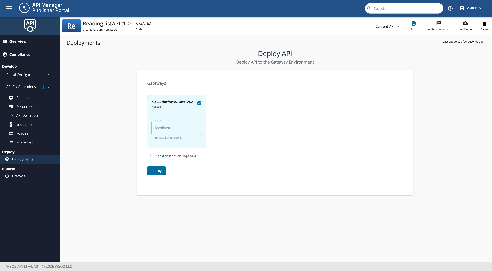
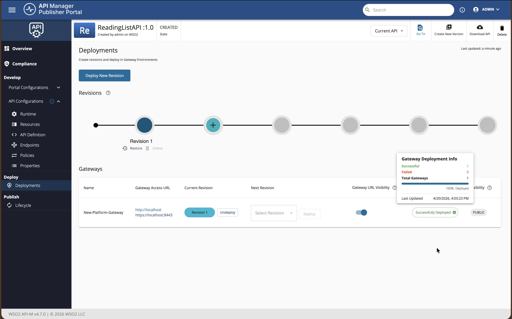
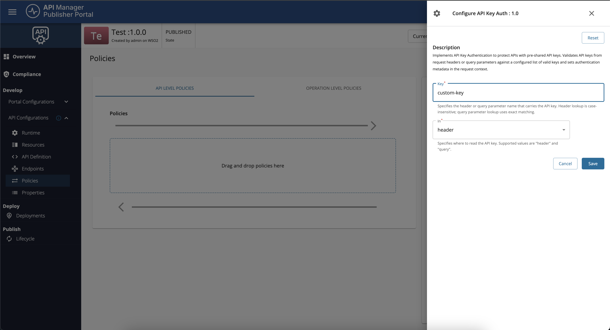
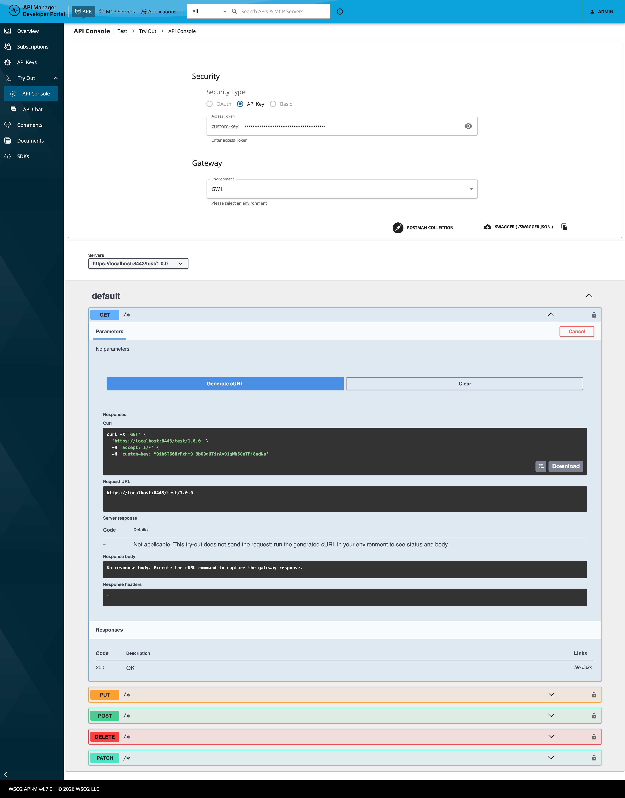

# Getting Started with API Platform Gateway

This guide walks you through setting up an API Platform Gateway in your environment. Follow these steps to get the gateway running and connected to the Control Plane.

## Overview

The API Platform Gateway is a lightweight gateway distribution intended for hybrid API Platform deployments where the gateway runtime stays in your own infrastructure, while API design, deployment, and visibility are handled centrally through the Control Plane.
You can also deploy gateway policies to APIs running on API Platform Gateway through Policy Hub.

## Prerequisites

Before you begin, ensure that you have the following:

- **cURL**
- **unzip**
- **Docker** installed and running
- **Docker Compose** installed

## Create an API Platform Gateway in the Admin Portal

1. Sign in to the **Admin Portal**.
2. Go to the **Gateways** section from the left navigation panel.
3. In the **WSO2 Gateways** section, click **Add WSO2 Gateways**.

    

4. Select **API Platform Gateway** from **Gateway Environment Type**.

    !!! info
        You can define multiple gateway package versions for API Platform Gateway. In `<API-M_HOME>/repository/conf/deployment.toml`, add or update `[apim.platform_gateway]` and set `versions` to a list of version strings. Restart API Manager for the change to take effect. The configured values are listed in the **Gateway version** drop-down when you add or edit a platform gateway.

        ```toml
        [apim.platform_gateway]
        versions = ["1.0.0", "1.1.0"]
        ```

5. Provide the following details:

    - **Display Name**: A unique name for your gateway.
    - **Description**: An optional description.
    - **URL**: The URL where the gateway will be accessible (host and port depend on your deployment; for example, `https://<gateway-host>:<gateway-port>`).
    - **Visibility**: Dev Portal visibility based on roles.
    - **Gateway version**: Select a version from the list configured on the Control Plane (see the note above).

    

6. Click **Add**.

## Setup the Gateway

1. Next, download, configure, and start the gateway on your machine by following the steps in the **Quick Start** section or the detailed instructions below (Steps 1-4).

    !!! note
        In Quick Start, copy the generated commands from the UI. For manual setup, use the detailed steps below.

    

### Step 1: Download the Gateway

Prefer the download command shown in the Admin Portal for your gateway so the release version always matches the connector. Alternatively, replace `<gateway-version>` in the following example with that release tag (for example, `v1.0.0`):

```bash
curl -sLO https://github.com/wso2/api-platform/releases/download/gateway/<gateway-version>/wso2apip-api-gateway-<gateway-version>.zip && \
unzip wso2apip-api-gateway-<gateway-version>.zip
```

### Step 2: Configure the Gateway

Run the following command to create the gateway configuration (use the same `<gateway-version>` folder name as in Step 1):

```bash
cat > wso2apip-api-gateway-<gateway-version>/configs/keys.env << 'ENVFILE'
GATEWAY_CONTROLPLANE_HOST=<your-control-plane-host>:9443
GATEWAY_REGISTRATION_TOKEN=<your-gateway-token>
ENVFILE
```

When you copy this command from the UI, the placeholder values are populated automatically.

### Step 3: Start the Gateway

Navigate to the gateway directory and start the gateway using Docker Compose:

```bash
cd wso2apip-api-gateway-<gateway-version>
docker compose --env-file configs/keys.env up
```

### Step 4: Verify the Gateway

Check that the gateway is running and connected:

```bash
# Check container status
docker compose ps

# Check gateway health (use the host and health endpoint port from your gateway configuration)
curl http://<gateway-host>:<gateway-health-port>/health
```

The gateway should appear as active in the Control Plane.



## Add an API and invoke it

!!! note
    This feature is currently available only for REST APIs that are created from scratch, or by importing from OpenAPI.

    It is not currently available for WebSocket, GraphQL, MCP, or AI APIs.

### Step 1: Create a REST API

In this example, you will use the URL of an OpenAPI definition to create a REST API.

For detailed API creation steps, see [Create a REST API]({{base_path}}/api-design-manage/design/create-api/create-rest-api/create-a-rest-api/).

1. Sign in to the **Publisher Portal**.
2. Click **REST APIs**.
3. Select **Import Open API**.
4. Select the **URL** option and provide the following URL:

```text
https://raw.githubusercontent.com/wso2/bijira-samples/refs/heads/main/reading-list-api/openapi.yaml
```

5. Select the gateway type as **API Platform Gateway**.
   
    

6. Click **Create**.

### Step 2: Deploy the REST API

This step is optional during the initial creation because the API is deployed to the gateway by default. If you change the API later, you must redeploy it.

To redeploy the API:

1. Navigate to the **Deployments** page of the API.
   
    

2. Click **Deploy**.
   
    

## Test the API

APIs deployed to **API Platform Gateway** rely on [Policy Hub](https://wso2.com/api-platform/policy-hub) policies for runtime security. Depending on what you attach to the API, the gateway may expect **API key**, **JWT / OAuth-style bearer token**, **HTTP Basic** credentials, or other supported schemes.

In the **Dev Portal**, open the API **Try out** (API Console) view. The **Security** section lists only the auth types that apply to that API (for example **OAuth2** for JWT-style policies, **API Key** for API key policies, **Basic** for basic auth). If the API has no auth policies, the Security section may be hidden.

If you use an [API Key Authentication](https://wso2.com/api-platform/policy-hub/policies/api-key-auth) policy, the **API key header name** is configured in the policy (it may be a custom header rather than a generic default). Configure it in the Publisher under **Develop** → **Policies** before you deploy.



In **Try out**, choose **API Key**, enter your key, then execute the request or copy **Generate cURL**. The generated command uses the **same header name** as in the policy, so it stays aligned with the gateway.



You can also invoke the API with cURL manually. Replace `<gateway-host>` and `<gateway-port>` with the host and port from the gateway **URL** you set in the Admin Portal. Use the header name from your policy (for example replace `X-API-Key` below if your policy defines a custom name).

### cURL examples

1. **No authentication** (no auth policy, or policy not in the request path for this call)

```bash
curl "https://<gateway-host>:<gateway-port>/readinglistapi/1.0/books" -X GET -k
```

2. **API key** (use the header name from your policy; the following example uses `X-API-Key`—replace it if your policy defines a custom header as in the screenshots above)

```bash
curl -k -i "https://<gateway-host>:<gateway-port>/readinglistapi/1.0/books" \
  -H "X-API-Key: <your-api-key>"
```

3. **Bearer token** (when a JWT or OAuth-style policy applies; example uses `Authorization`)

```bash
curl -k -i "https://<gateway-host>:<gateway-port>/readinglistapi/1.0/books" \
  -H "Authorization: Bearer <your-access-token>"
```

4. **HTTP Basic** (when a basic auth policy applies)

The Dev Portal encodes your credentials and sets `Authorization: Basic` followed by the Base64 string (same as the generated cURL from **Try out**). Use that header when copying from the console; `<base64-credentials>` is the Base64 encoding of `username:password`.

```bash
curl -k -i "https://<gateway-host>:<gateway-port>/readinglistapi/1.0/books" \
  -H "Authorization: Basic <base64-credentials>"
```

Equivalently, cURL can build the same header with `-u`:

```bash
curl -k -i "https://<gateway-host>:<gateway-port>/readinglistapi/1.0/books" \
  -u "<username>:<password>"
```

If authentication fails, confirm the policy is deployed, the header names match the policy and API configuration, and you have redeployed the API after policy changes.

!!! info
    - For policy configuration steps, see [Adding and Managing Policies]({{base_path}}/api-gateway/api-platform-gateway/adding-and-managing-policies/).
    - Gateway policies for this deployment model are sourced from [Policy Hub](https://wso2.com/api-platform/policy-hub). Choose the policy that matches your security model (for example [API Key Authentication](https://wso2.com/api-platform/policy-hub/policies/api-key-auth) or other JWT, OAuth, or Basic policies listed there).

## Next steps

- [Setting Up API Platform Gateway]({{base_path}}/api-gateway/api-platform-gateway/setting-up/)
- [Adding and Managing Policies]({{base_path}}/api-gateway/api-platform-gateway/adding-and-managing-policies/)
