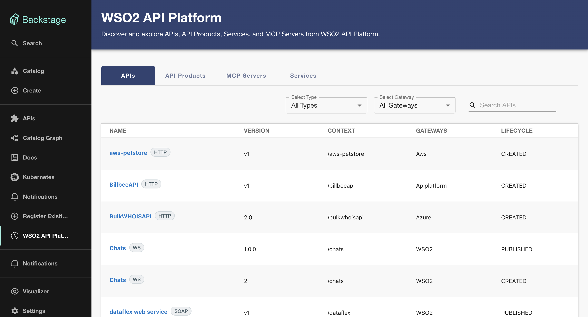
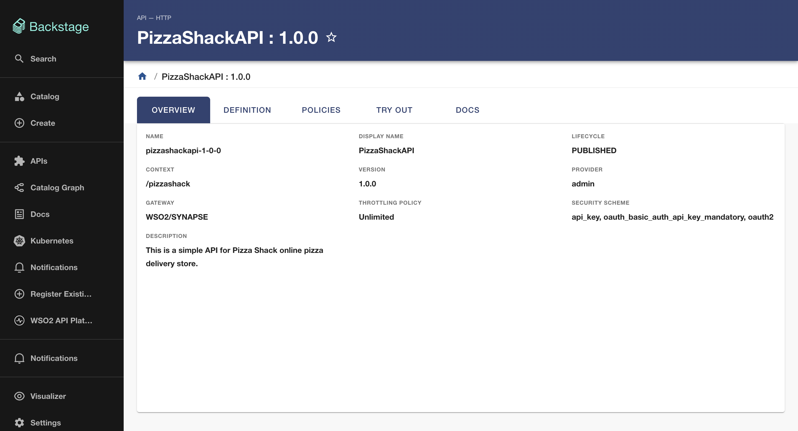
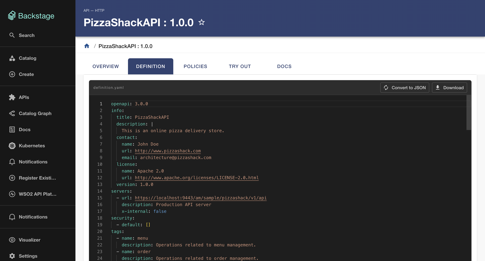
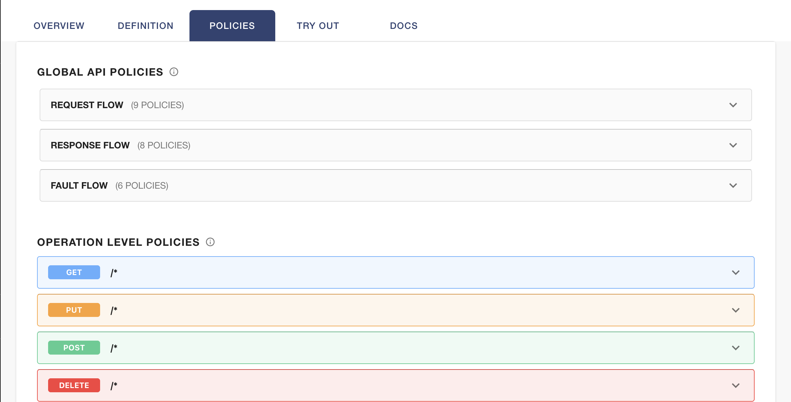
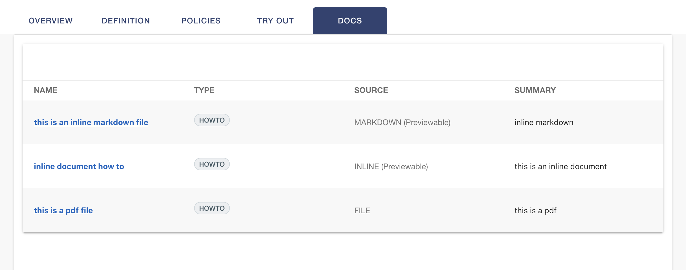
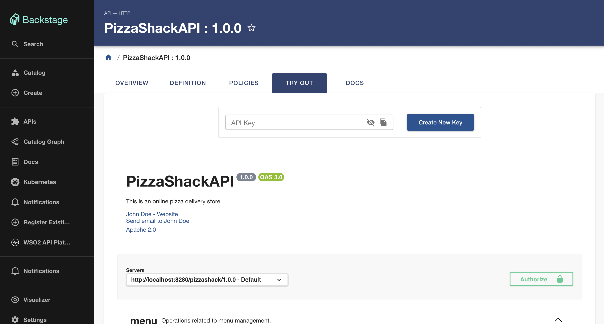
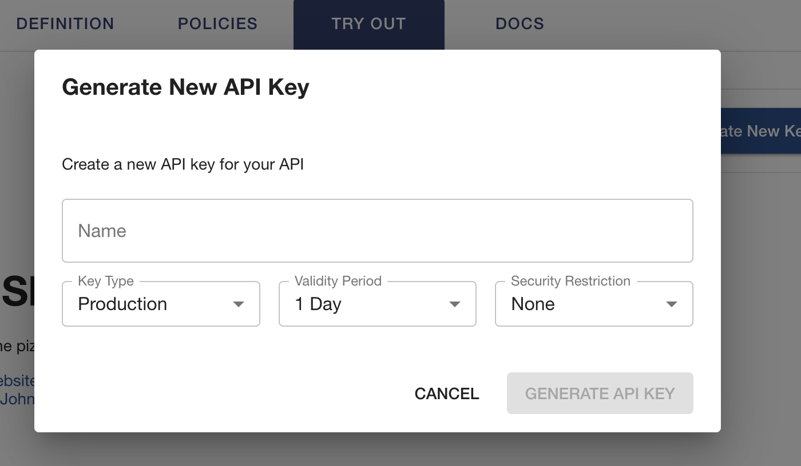
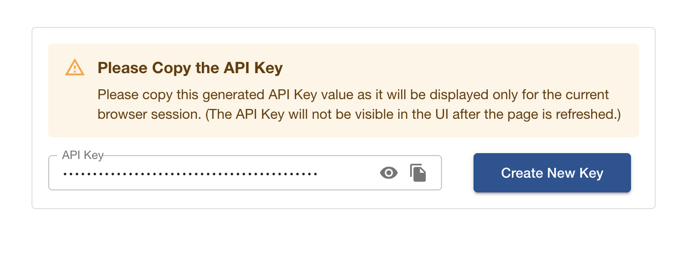

# Tutorials

Follow this tutorial to learn how to discover APIs using the Backstage Plugin for WSO2 API Platform, explore their definitions, policies, and documents, and finally invoke them using the interactive console.

## Browsing and Invoking an API in Backstage

Imagine you are a developer working on a new application that needs to display a pizza menu and place orders. You know that your company has an internal PizzaShackAPI managed by the WSO2 API Platform. Instead of switching over to the WSO2 API Developer Portal, you can use Backstage to discover, explore, and invoke this API directly.

### Step 1 - Discover the API

First, you need to locate the PizzaShackAPI in your Backstage catalog.

1. Navigate to the **WSO2 API Manager** page from your Backstage sidebar.
2. The page displays a global view of all APIs, API Products, MCP Servers, and Services ingested from the WSO2 API Platform.
3. Use the **search bar** or use the **Select Type** and **Select Gateways** dropdowns to find the PizzaShackAPI.

    

4. Click on the API to navigate to its **Entity Page**.

### Step 2 - Explore the API Details

Once you are on the Entity Page for the PizzaShackAPI, you can explore the available entity tabs to learn more:

The **Overview** tab is displayed by default. Here you can view basic metadata about the API.

Navigate to the **Definition** tab. Since this is an HTTP/REST API, you can view the OpenAPI/Swagger definition to understand the available endpoints. If you were viewing a different type of API or entity, the definition view would adapt accordingly

Check the **Policies** tab to understand the API-level and operation-level policies applied to this API. This helps you understand rate limits or security requirements before making requests.

If you need more context, go to the **Docs** tab. Here you can view and download any attached API documents. Inline and Markdown documents can be previewed directly within Backstage, while other file formats are available for download.

### Step 3 - Try Out the API

If you want to invoke and test the API directly within Backstage, go to the **Try Out** tab. 

For native APIs that meet the required conditions (like the PizzaShackAPI, which is an API key-bound, deployed and a  subscriptionless API), you can manage credentials directly within Backstage. If you already have an existing API key, you can simply paste it into the console. Otherwise, you can generate a new one on the spot:

1. Locate the **API Key Generation** card on the **WSO2 API Manager** tab.

    

2. Click **Generate New Key**.

3. A configuration dialog will appear. Enter a name and configure your key settings. 
    - By default, the validity period of the API key will be **one day**. However, you can adjust the dropdown to change it.
    - You can also configure additional security restrictions on the API key, such as IP address allowlisting, as shown in the following image.

    

4. Click **Generate API Key** in the dialog. 

5. Please ensure you copy the secure API key that is displayed, as it will only be visible for the current browser session and will be gone if you refresh the page. Do not refresh until you have copied it.

    

    Now that you have your credentials, you can proceed to test the API. 

6. In the console, expand the GET /menu operation.
7. Click **Try it out**.
8. Use the API key you generated (or your external credentials) to authenticate your request.
9. Click **Execute**. 
10. You will see the JSON response returned from the gateway directly within the console, listing all available pizzas in the menu!

You have successfully discovered an API, explored its metadata, managed credentials, and invoked it-all without ever leaving your Backstage developer portal!
