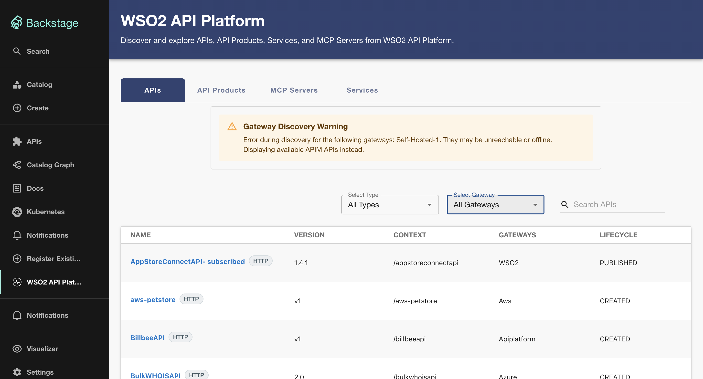

# Troubleshooting

This page covers known issues, error patterns, and how to resolve them when using the WSO2 Backstage plugin suite. Before proceeding, please make sure you have completed the [setup process](setup/installation-and-configuration.md) correctly.

### Plugin fails to initialize due to incorrect architecture setup

When setting up the plugins, make sure you follow the guide that matches your Backstage architecture:

- If you use the **New Backend System**, follow the [Standard Setup](setup/installation-and-configuration.md).
- If you use the **Legacy Backend System**, follow the [Legacy Setup](setup/legacy-setup.md).

If you have a **hybrid setup** (e.g., using the New Backend System with the Legacy Frontend System, or vice versa), simply follow the specific backend/frontend instructions suited for your instance.

### Gateway Discovery Warning is displayed on the APIs tab

If you see a Gateway Discovery Warning on the APIs tab:



First, check if API Manager and Platform Gateway are enabled in your app-config.yaml:
```yaml
wso2ApiManager:
  enabled: true
  
wso2PlatformGateway:
  enabled: true
```

The WSO2 API Manager and Platform Gateway integrations work independently. If you only need to use one of them (e.g., just the API Manager), you can simply set enabled: false for the other in your configuration. The plugin will continue to function normally without displaying offline warnings for the disabled component.

### Connection fails due to self-signed certificate (TLS) errors

If WSO2 uses a self-signed certificate, ensure tls.rejectUnauthorized: false is set in the config (for development/internal environments only).

### Troubleshooting authentication credentials or missing scope errors

Ensure that the user or service account associated with your auth.clientId and auth.clientSecret has been granted the **required access** in WSO2. The specific scopes needed by the plugin are defined in your app-config.yaml file. 

Also, double-check that your auth.clientId, auth.clientSecret, and auth.tokenUrl are entered correctly.

### Changes in WSO2 API Manager are not syncing to Backstage

The catalog provider runs on a schedule. If you have done some changes to WSO2 API Manager and it's still not reflected in Backstage, it might be due to the catalog sync. You have to wait until the next sync is done.

### Generate New Key button is not available for an API

**Symptom:** The API key generation action is not shown for an API.

**Resolution:** API key generation is only available when all of these conditions are met:

- The API is subscriptionless.
- API key invocation is enabled in the WSO2 configuration.
- The API is deployed (has an active revision/deployment).
- The API was discovered through WSO2 (not a self-hosted gateway or from a third party gateway like AWS etc).

We provide user-friendly notifications and error messages directly from the Try Out panel to help diagnose the issue. However, if these messages are not helpful, you can check the configurations in the WSO2 API Manager directly.
