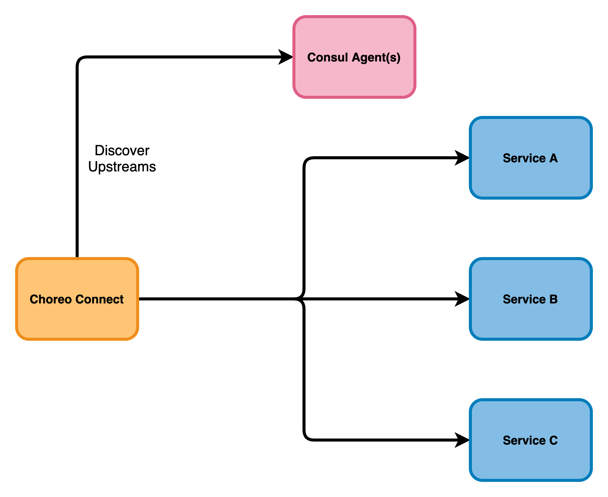

# Configure Choreo Connect with Consul Discovery (without service mesh)



## Step 1 - Setup Consul
Set up Consul securely.<br>
For more instructions, see the [Consul official documentation](https://www.consul.io/docs).
## Step 2 - Configure Choreo Connect

``` 
[adapter.consul]
  enable = true
  url = "https://169.254.1.1:8501"
  pollInterval = 5
  aclToken = "d3a2a719-4221-8c65-5212-58d4727427ac"
  mgwServiceName = "choreo-connect"
  serviceMeshEnabled = false
  caCertFile = "/home/wso2/security/truststore/consul/consul-agent-ca.pem"
  certFile = "/home/wso2/security/truststore/consul/local-dc-client-consul-0.pem"
  keyFile = "/home/wso2/security/truststore/consul/local-dc-client-consul-0-key.pem"
```

## Step 3 - Deploy the API
You can use either WSO2 API Manager or APICTL to deploy APIs as described in []()