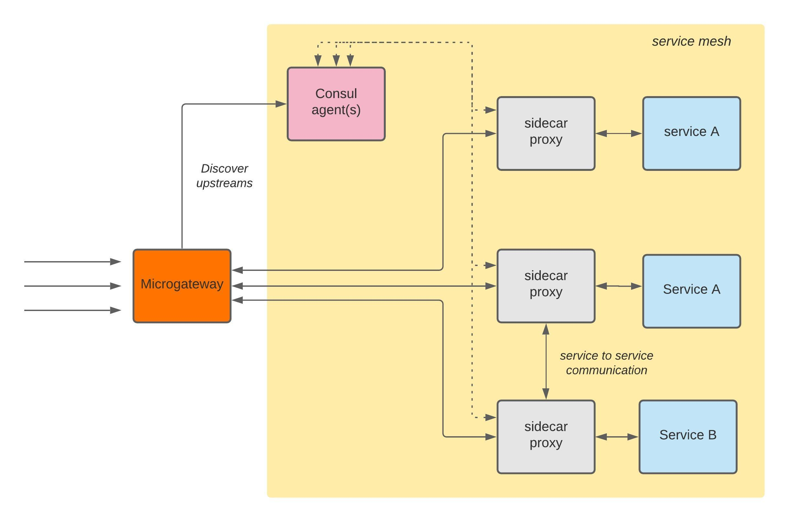

# Service Discovery

In a microservice environment, usually the running service endpoints are not static. A service may have multiple upstream endpoints. Therefore, service discovery mechanism is required for services to locate other services' upstream endpoints.

A service mesh deployed when services want to communicate with each other with zero trust. Consul is a service mesh solution, which has been developed by HashiCorp. It solves the following problems that occur in microservice environments:

1. Service Discovery - through a centralized service registry.
2. Access control - through Intentions, and ACL
3. Configuration Management

WSO2 API Microgateway can be used as an ingress gateway in an environment that uses Consul as a service mesh so that the APIs or services can be exposed to developers or API consumers while providing security, rate limiting, and other QoS.

Therefore, WSO2 Microgateway supports service discovery using the Consul so that upstream services can be discovered automatically.
WSO2 Microgateway supports service discovery by connecting to [Consul service registry](https://www.hashicorp.com/products/consul) and discover upstream services automatically.

Please refer to the [Consul official documentation](https://www.consul.io/docs) to set up Consul securely.



#### Step 1 - Enabling Consul service discovery

Add the following configuration under the Adapter section to the configuration file of the Microgateway (config.toml)

``` java
[adapter.consul]
enable = true
url = "https://169.254.1.1:8501"
pollInterval = 5
aclToken = "4f295904-1b7f-8abd-3058-cecb06ee3338"
caFile = "/home/wso2/security/truststore/consul/ca.pem"
certFile = "/home/wso2/security/truststore/consul/cert.pem"
keyFile = "/home/wso2/security/truststore/consul/key.pem"
```

The configurations are described in the table below.

|<div style="width:100px">Property</div>| Description                                                                    |
|---------------------------------------|--------------------------------------------------------------------------------|
| `enable`                              | Set this to true to enable Consul service discovery. |
| `url`                                 | The `URL` of the [Consul HTTP API](https://www.consul.io/api-docs#http-api-structure).|
| `pollInterval`                        | The time interval (in seconds) in which the Microgateway should fetch updates from Consul service catalog.|
| `aclToken`                            | [ACL Token](https://learn.hashicorp.com/tutorials/consul/access-control-setup-production) generated using Consul.|
| `caFile`                              | CaFile is the optional path to the CA certificate used for Consul communication, defaults to the system bundle if not specified.|
| `certFile`                            | CertFile is the optional path to the certificate for Consul communication. If this is set then you need to also set `keyFile`.|
| `keyFile`                             | KeyFile is the optional path to the private key for Consul communication. If this is set then you need to also set `certFile`.|


!!! note
        `caFile`, `certFile`, and `keyFile` are optional and needed when you need to override the Adapter's default CA, certificate, and private key.<br>
        If Consul agent's [verify_incoming](https://www.consul.io/docs/agent/options#verify_incoming) configuration is set to true, the certificate and private key has to be signed by the same
        CA that the Consul agents' certificates are signed.


#### Step 2 - Deploy an API that contains services registered with Consul service catalog

You can set the Consul upstreams using the service name as the key and providing a default host.

Example 1:

```java tab="Format"
x-wso2-production-endpoints:
  urls:
    - consul(<service_name>,<default_host>)
  type: loadbalance
```

```java tab="Example"
paths:
  /pet:
    x-wso2-production-endpoints:
      urls:
        - consul(pet,https://10.10.1.5:5000)
      type: loadbalance
    post:
      consumes:
        - application/json
        - application/xml
      description: ""
      operationId: addPet
      parameters:
        - description: Pet object that needs to be added to the store
          in: body
          name: body
          required: true
          schema:
            $ref: '#/definitions/Pet'
```

Example 2:<br>
If you want more fine-grained access to your Consul services, you can limit the access to the upstream services by providing
the `datacenters` and `tags`

```java tab="Format"
x-wso2-production-endpoints:
  urls:
    - consul([<datacenter_1>,<datacenter_2>].<service_name>.[tag_1,tag_2],<default_host>)
  type: loadbalance
```

```java tab="Example"
paths:
  /pet:
    x-wso2-production-endpoints:
      urls:
        - consul([aws-east,gcp-west].pet.[prod],https://10.10.1.5:5000)
      type: loadbalance
    post:
      consumes:
        - application/json
        - application/xml
      description: ""
      operationId: addPet
      parameters:
        - description: Pet object that needs to be added to the store
          in: body
          name: body
          required: true
          schema:
            $ref: '#/definitions/Pet'
```

<!-- todo check the keyword for loadbalance once implemented -->
<!-- todo add info about cert rotation once implemented -->


!!! info
        1. The adapter takes one `pollInterval` amount of time to update the upstreams' data to the Router.
        During that time requests that arrive at the Microgateway are served from the
        `default_host`. <br>
        2. Consul upstreams can be discovered both on ***production-endpoints*** and ***sandbox-endpoints***.<br>
        3. Microgateway supports both API level and Resource level endpoints for Consul service discovery.<br>
        4. Upstreams discovered through Consul are configured as loadbalance clusters. Therefore, type under the vendor extension should be `loadbalance`.
        <br>
        5. Upon successfully [deploying your API](../api-microgateway/getting-started/quick-start-guide/quick-start-guide-overview.md), the Adapter will poll the Consul HTTP API for changes concerning the services.
        If a change occurs, or a health check fails, the Adapter will update the relevant cluster accordingly.

       
