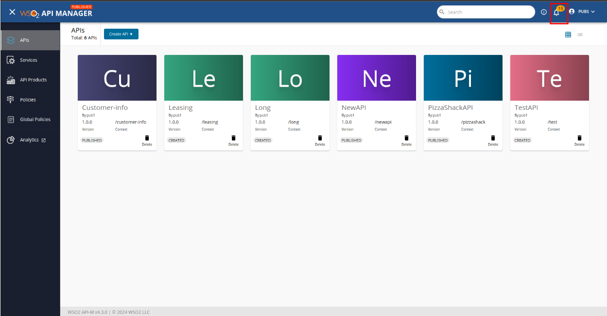
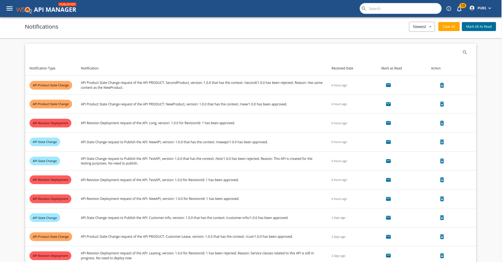
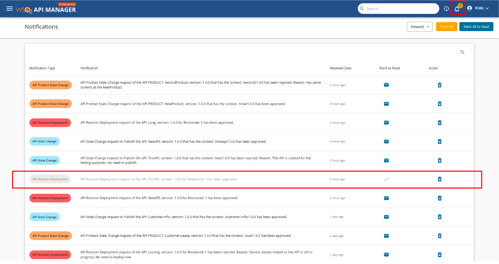
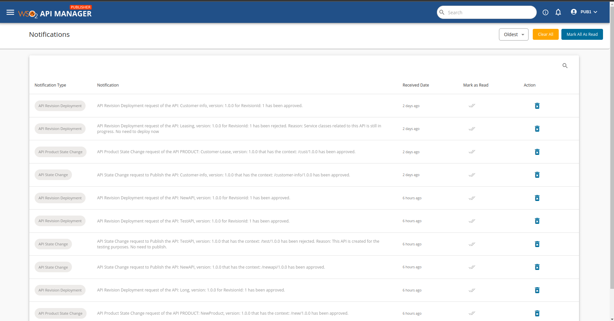
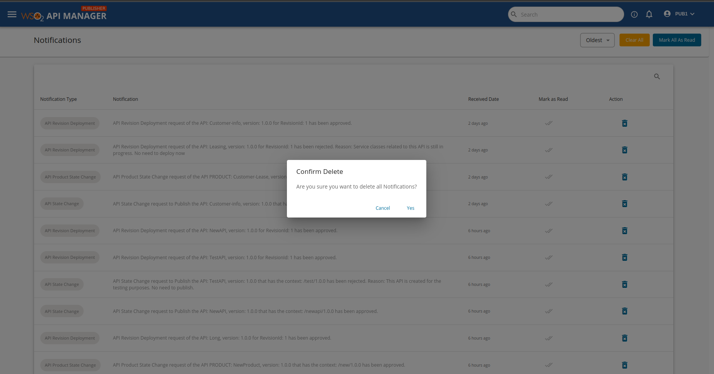
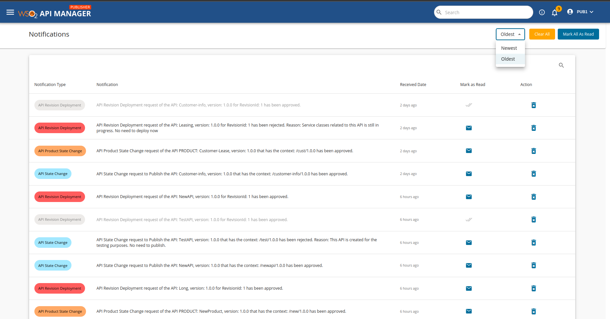
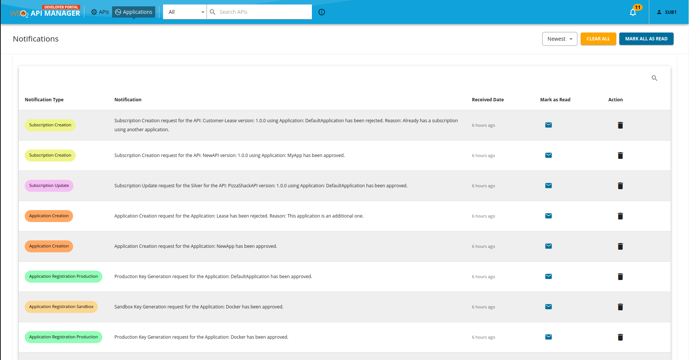

# Notifications

The Notification System for WSO2 API Manager addresses a critical deficiency within the platform by introducing a mechanism to inform API Publishers and Developers about crucial changes to their APIs or subscriptions. This system aims to enhance communication, transparency, and responsiveness within the API management processes by providing timely alerts and updates regarding significant events such as workflow rejections, subscription blockings, and API-related updates.

## Notifications in the Publisher Portal:

When a publisher user has new notifications, the bell icon on the header will display the number of unread notifications. These notifications include events such as workflow approvals or rejections and API-related updates.

 

 

Clicking the bell icon will navigate you to the notification page, where you can manage your notifications.

 

 

### Manage Notifications

1. **Mark Notifications as Read:** 

    After reading a notification, you can click on the "Mark as Read" icon associated with each notification. This action visually grayed out the notification, indicating that it has been read. The unread count displayed with the bell icon will update automatically.

     

    

     

    To mark all notifications as read with one click, use the "Mark all as Read" button displayed on the top bar of the notification page.

     

    

     

2. **Delete Notifications:**

    If you want to delete a specific notification, click on the delete icon next to it. A delete confirmation dialog will appear, and upon confirmation, the notification will be deleted.

     

    

     

    Similarly, you can delete all notifications at once by clicking the "Delete All" button on the top of the notification page.
    
     

    

     

3. **Sort Notifications:** 

    By default, the notifications are shown in the order of latest first. However, if you prefer to view older notifications first, you can change the sort option to 'oldest'.

     

    

     

## Notifications in the Developer Portal:

The notification management process for developers is identical to that of publishers. Therefore, developers can follow the same instructions provided for [Notifications in the Publisher Portal](#NotificationsInThePublisherPortal).

 

 

### Conclusion:

The Notification System for WSO2 API Manager is a crucial feature that enhances communication, transparency, and responsiveness within the API management processes. By providing timely alerts and updates, stakeholders can effectively manage their APIs and subscriptions, leading to improved efficiency and productivity. Regularly checking and responding to notifications is important to stay informed and to ensure smooth API management operations.

