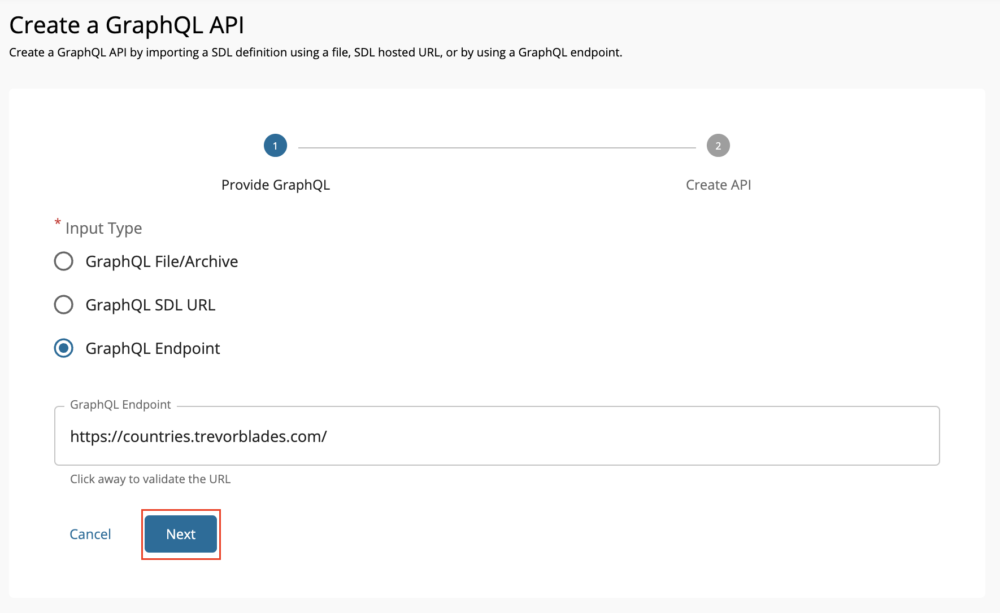
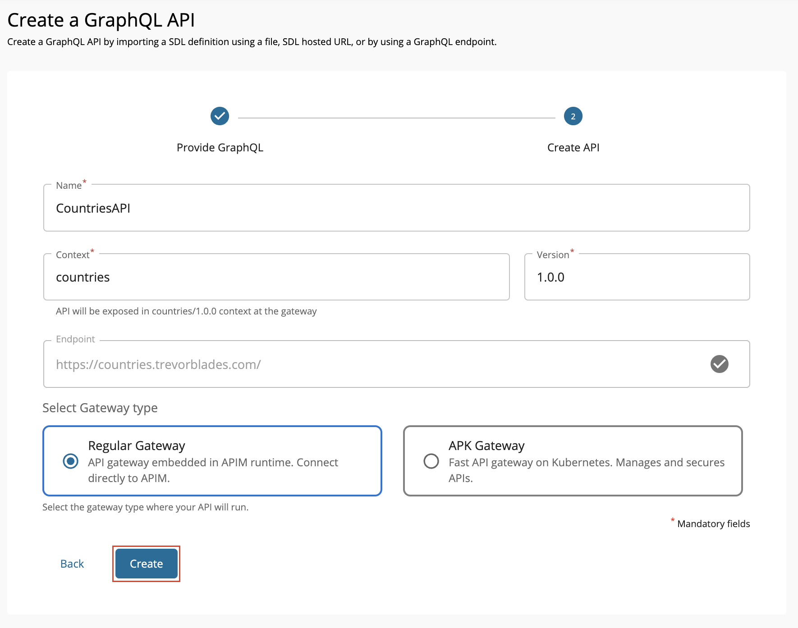
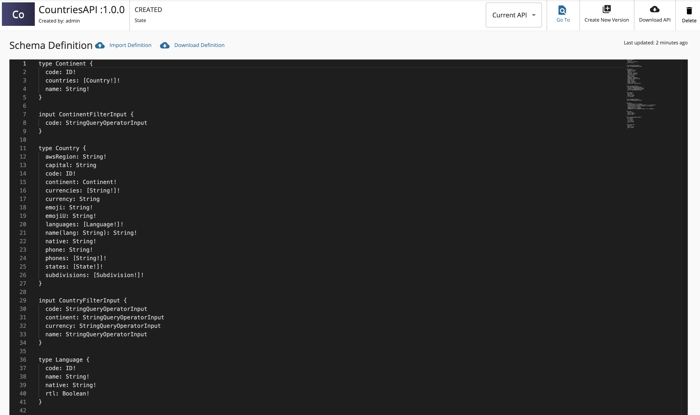

### Create a GraphQL API using Introspection

A GraphQL introspection query allows you to explore the structure of an existing GraphQL API. By using [introspection](https://graphql.org/learn/introspection/), you can generate the GraphQL schema definition of an API.

Follow the instructions below to create a GraphQL API using introspection.

1. Sign in to the Publisher Portal of WSO2 API Manager.

    `https://<hostname>:9443/publisher` (e.g., `https://localhost:9443/publisher`).

    <html>

        
Note

        
The <b>Create API</b> button will only appear if you have the "creator" role permission.

        

    </html>

2. Click **Create API** and then click **Create GraphQL API**.

    

3. Select **GraphQL Endpoint** and provide the endpoint of an existing GraphQL API. Click **Next**.

    

    
Note

    <ul><li>
    
You need to ensure the GraphQL API supports introspection.
</li>
    <li>Currently, introspection based GraphQL API creation requires the endpoint to be unprotected.</li></ul>
    

    [{: style="width:80%"}](../../../assets/img/learn/create-graphql-api-using-introspection.png)

4. Enter the GraphQL API related details and click **Create**.

   Let's create an API named "CountriesAPI" using the following sample data.

   <table>
   <thead>
   <tr class="header">
   <th>

   

   <b>Field</b>
   

   
</th>
   <th>

   

   <b>Description</b>
   

   
</th>
   </tr>
   </thead>
   <td >
       
Name

   </td>
   <td>
       
CountriesAPI

   </td>
   </tr>
   <tr>
   <td>
       
Context

   </td>
   <td>
       
<code>/countries</code>

   </td>
   </tr>
   <tr>
   <td>
       
Version

   </td>
   <td>
       
1.0.0

   </td>
   </tr>
   <tr>
   <td>
       
Endpoint

   </td>
   <td>
       <a href="https://countries.trevorblades.com/" target="_blank">https://countries.trevorblades.com/</a>
           

   
Note

   

   <ul>
   <li>The endpoint will be set to the URL given in the previous step and it will be readonly. The endpoint can be changed after the API is created under endpoints section </li>
   </ul>

   

   </td>
   </tr>
   </table>

   [{: style="width:75%"}](../../../assets/img/learn/create-graphql-api-using-introspection-metadata.png)

### Operations

Click **API Configurations** and then click **Operations** to navigate to the Operation page.

You will notice that all the GraphQL API operations are created automatically when the Endpoint URL is specified.

### Schema Definition

Click **API Configurations** and then click **Schema Definition** to navigate to the Schema Definition page.

You can view the schema definition generated by introspection.

