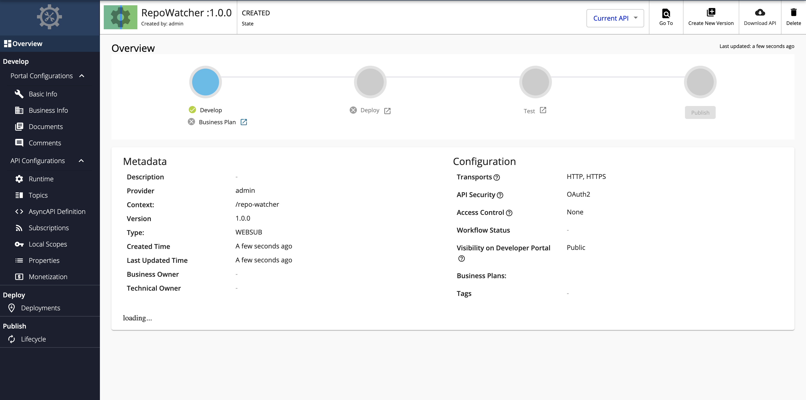
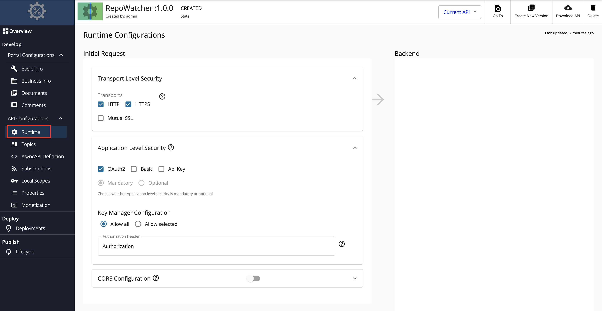

# Create a WebSub/WebHook API

## Overview

A WebSub API, also known as a WebHook API, is a streaming API in WSO2 API Manager that is implemented based on the [WebSub](https://www.w3.org/TR/websub/) protocol specification. WebSubs only allows one-way communication, from a caller web app to a callee web app. After the API is created, it will provide you a call back URL, which you can register to any WebHook provider. Therefore, the user-facing API from API Manager will adhere to WebSub specification whereas the backend can be anything that could send events to this callback URL.

You can create a WebSub API from scratch in WSO2 API-M and export the WebSub APIs that are created within WSO2 API-M as AsyncAPI definitions. Alternatively, you can also import [existing AsyncAPI definitions to create SSE APIs in WSO2 API-M](../../../../use-cases/streaming-usecase/create-streaming-api/create-a-streaming-api-from-an-asyncapi-definition).

This section will guide you through the process of creating a WebSub API from scratch in WSO2 API-M. After a WebSub API is created, you will be able to register it's URL as the callback URL for your WebHook provider and be able to receive events from them.

## How it works

The client who intends to receive the events from the server, web app or publisher has to register its URL against the interesting events in the publisher. When an event occurs, if a client is registered for that event, the publisher will make an HTTP POST request to the registered URL of the client to notify the event.

## Example usage

For example, you can use WebSub APIs to get notifications as soon as a new message is received in a specific Slack channel. WebSub APIs can also be used to get notifications when a new commit is added or a new issue is created on a GitHub repository. Likewise, WebSub APIs are used to send notifications to an already registered web URL with regard to the changes that happen in the WebHook provider (e.g., GitHub, PageDuty, Slack, SendGrid, etc.)

## Basic flow

Follow the instructions below to create a WebHook API using the basic flow:

### Step 1 - Design a WebSub/Webhook API

1.  {!includes/sign-in-publisher.md!}

2.  Click **CREATE API**, go to **Streaming API**, and Click **Webhook API**.

    <html>

      
Note

      
The <b>CREATE</b> button will only appear for a user who has the <code>creator</code> role permission.

      

    </html>

    

3.  Enter the details of the new WebSub/Webhook API.

     <table>
     <thead>
     <tr>
     <th><b>Field</b></th>
     <th><b>Sample value</b></th>
     </tr>
     </thead>
     <tbody>
     <tr>
     <td>Name</td>
     <td>RepoWatcher</td>
     </tr>
     <tr>
     <td>Context</td>
     <td>/repo-watcher</td>
     </tr>
     <tr>
     <td>Version</td>
     <td>1.0.0</td>
     </tr>
     <tr>
     <td>Protocol</td>
     <td>WebSub</td>
     </tr>
     </tbody>
     </table>

4.  Click **CREATE**.

     The overview page of the created WebSub/WebHook API appears.

     

### Step 2 - Configure the Topics

Topics of a WebSub/Webhook API are always **Subscribe only**. By default, a WebSub/Webhook API will have a topic with the name `_default`.

1. Click **Topics** under **API Configurations** to navigate to the **Topics** page.

2. Modify the topics as follows and click **Save** to update them.

    1. Optionally, click delete, as shown below, to delete an existing topic.

        

    2. Select **sub** under **Types**, enter the **Topic Name**, and click **+** as shown below, to add a new topic.

         

         The newly added topic is displayed as follows.

         

         Expand the created topic to view its **Callback URL**. You can use this when registering the topic with a WebHook provider (WebSub Provider).

### Step 3 - View the AsyncAPI Definition

Click **AsyncAPI Definition** under **API Configurations**.

The AsyncAPI definition of the streaming API, which you just created, appears.

   

### Step 4 - Configure the Runtime Configurations

1. Click **Runtime** under **API Configurations**.

    The Transport Level Security defines the transport protocol on which the API is exposed.

    

2. If you wish to limit the API availability to only one transport (e.g., HTTPS), uncheck the appropriate checkbox under **Transport Level Security**.

     Both HTTP and HTTPS transports are selected by default.

### Step 5 - Generate a Secret

When required by a WebHook provider (e.g., GitHub), the secret generated by the WebSub/WebHook API can be used to register the WebSub/WebHook API with the WebHook provider. This is used by the WebHook provider to sign the payload when sending events back to the WebSub/WebHook API.

1. Click **Topics** under **API Configurations** to navigate to the Topics page, and expand the **Subscription Configuration** section.

2. Click **Enable** to enable subscription configurations.

3. Select **SHA1** as the **Signing Algorithm**.

4. Click **Generate**, which will generate a secret.

     

5. Click **Save**.

     The generated secret can be used when registering the topic with a WebHook provider.

Now, you have successfully created and configured a Streaming API. Next, let's [Publish your API](../../../../deploy-and-publish/publish-on-dev-portal/publish-an-api).

## End-to-end tutorial

Learn more by trying out an end-to-end tutorial on <a href="../../../../tutorials/streaming-api/create-and-publish-websub-api">Creating and Publishing a WebSub API</a>, which uses the default Streaming Provider that works with WSO2 API Manager, namely the WSO2 Streaming Integrator.

## See Also

{!includes/design/stream-more-links.md!}
