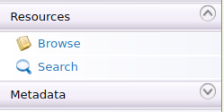
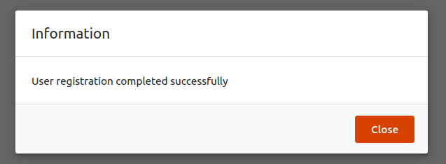
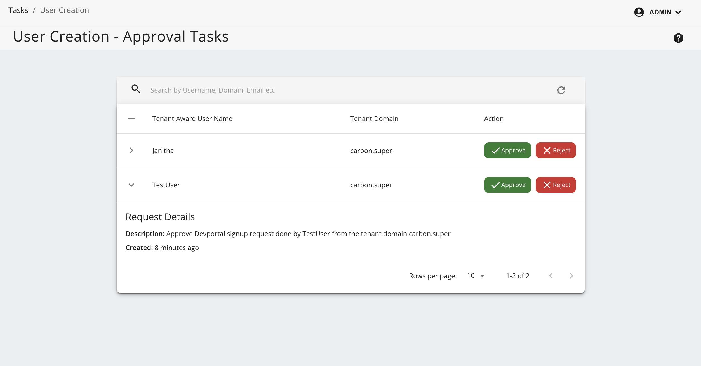

# Adding a User Signup Workflow

#### Engaging the Approval Workflow Executor in the API Manager

1.  Log in to API-M management console ( `https://<Server-Host>:9443/carbon` ) and select **Browse** under **Resources**.

    

2.  Go to `/_system/governance/apimgt/applicationdata/workflow-extensions.xml` resource, disable the **Simple Workflow Executor** and enable **Approval Workflow Executor** for user self sign up.

    ```
    <WorkFlowExtensions>
        ...
            <!--UserSignUp executor="org.wso2.carbon.apimgt.impl.workflow.UserSignUpSimpleWorkflowExecutor"/-->
            <UserSignUp executor="org.wso2.carbon.apimgt.impl.workflow.UserSignUpApprovalWorkflowExecutor"/>
        ...
    </WorkFlowExtensions>
    ```

3.  Go to the Developer Portal Web interface of API Manager and sign up / register as a new user. (Go to **Sign in** --> **Create Account**  and add the details of the new user).
<html>
    <body>
        <div>
            
        </div>
    </body>
</html>

4.  Note the message that appears if the Approval Workflow Executor is invoked correctly, saying that the request is successfully submitted.

    

5.  Log in to the [Admin Portal](`https://localhost:9443/admin`) (`https://<Server-Host>:9443/admin`) of API Manager giving the admin username and password.

6.  Navigate to **Tasks** --> **User Creation** and approve or reject the user signup task listed by clicking on approve or reject.

    

7.  Go back to the Developer Portal and see that the user is now registered. If the user is successfully registered then user can login to devportal successfully with that account.

