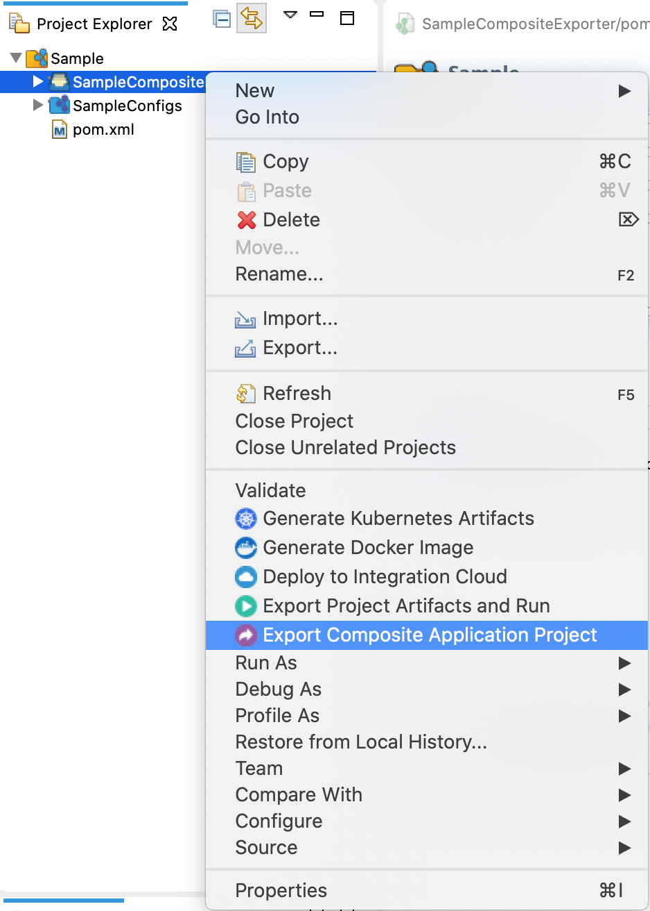

# Exporting packaged Synapse artifacts

Once you have [packaged your artifacts](packaging-artifacts.md) into a composite application, you can
export it into a CAR file (.car file):

1.  Select the Composite Exporter module in the project explorer,
    right-click, and click **Export Composite Application Project** .  
    
2.  In the dialog that opens, give a name for the CAR file, the destination where the file should be saved, and click **Next**.
3.  You can select the artifacts that should be packaged in the CAR file.
4.  Click **Finish** to generate the CAR file.