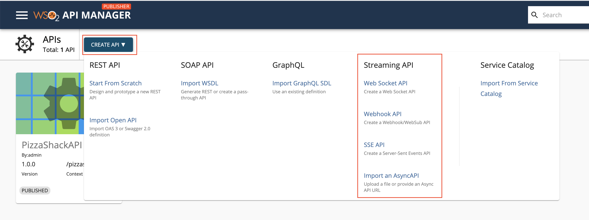
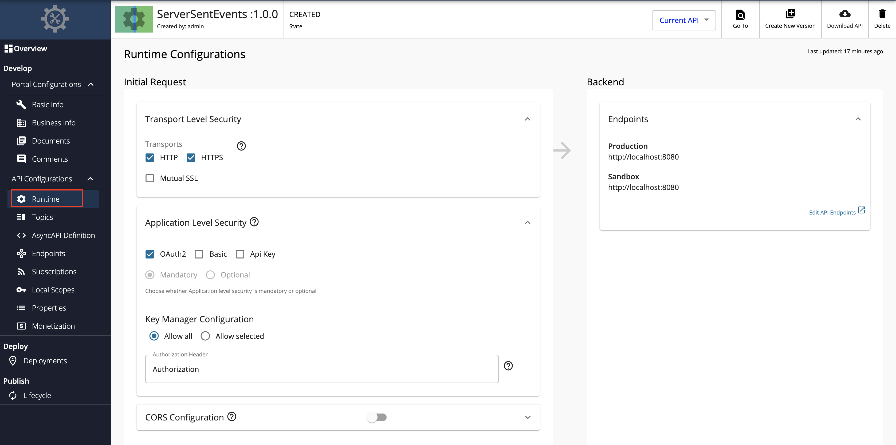

# Create a Server Sent Events API

## Overview

A Server-Sent Events (SSE) API is a streaming API in WSO2 API Manager (WSO2 API-M) that is implemented based on the [SSE](https://html.spec.whatwg.org/multipage/server-sent-events.html#server-sent-events) specification. SSE is an HTTP-based protocol that allows one-way communication similar to WebHooks, from the server to the client. The SSE server transfers events over an already established connection without creating new connections. Therefore, the SSE protocol has a lower delivery latency when compared to typical HTTP. WSO2 API Manager allows API Developers to integrate an SSE backend with an API and to receive events from the backend.

You can create an SSE API from scratch in WSO2 API-M and export the SSE APIs that are created within WSO2 API-M as AsyncAPI definitions. Alternatively, you can also import [existing AsyncAPI definitions to create SSE APIs in WSO2 API-M](../../../../use-cases/streaming-usecase/create-streaming-api/create-a-streaming-api-from-an-asyncapi-definition).

This section guides you through the process of creating an API from scratch, which will expose a SSE backend via WSO2 API Manager. After an SSE API is created, you will be able to add different topics and each topic can be mapped to different paths of the backend and can be used to manage them.

## How it works

SSE APIs use regular HTTP requests for a persistent connection. In addition, it gets multiplexing over HTTP/2 out-of-the-box. If the connection drops, the EventSource fires an error event and automatically tries to reconnect. The server can also control the timeout before the client tries to reconnect. Clients can send a unique ID with messages. When a client tries to reconnect after a dropped connection, it will send the last known ID. Then the server can see that the client missed "n" number of messages and send the backlog of missed messages on reconnection.

## Example usage

For example, stock market applications use SSE APIs to send messages in a uni-directional manner from the server to the client. Therefore, if users need the latest stock market prices, they will subscribe to the respective channel that publishers stock market stats. Thereafter, the server will keep sending the user the latest stock market prices as and when it gets updated in order to provide an immediate user experience.

## Basic flow

Follow the instructions below to create the API using the basic flow.

### Step 1 - Design a SSE API

1.  {!includes/sign-in-publisher.md!}

2.  Click **CREATE API**, go to **Streaming API**, and Click **SSE API**.

    <html>

      
Note

      
The <b>CREATE</b> button will only appear for a user who has the <code>creator</code> role permission.

      

    </html>

    

3.  Enter API details.

     <table>
         <colgroup>
             <col/>
             <col/>
             <col/>
         </colgroup>
         <tbody>
             <tr>
                 <th colspan="2"><b>Field</b></th>
                 <th ><b>Sample
          value</b></th>
             </tr>
             <tr>
                 <td colspan="2" class="confluenceTd">Name</td>
                 <td class="confluenceTd">ServerSentEvents</td>
             </tr>
             <tr>
                 <td colspan="2" class="confluenceTd">Context</td>
                 <td class="confluenceTd">
                     

                         

                             <code>/events</code>
                         

                         

                             

                                 
The API context is used by the Gateway to identify the API.
          Therefore, the API context must be unique. This context is the API's root context when invoking the API through
          the Gateway.

                             

                             

                                 
                                 

                                     
You can define the API's version as a parameter of its context by
          adding the <code>{version}</code> into the context. For example, <code>{version}/event</code>. The API Manager
          assigns the actual version of the API to the <code>{version}</code> parameter internally. For example,
                                         <code>https://localhost:8243/1.0.0/event</code>. Note that the version appears before the context, allowing you to
          group your APIs based on the versions.

                                 

                             

                         

                     

                 </td>
             </tr>
             <tr>
                 <td colspan="2" class="confluenceTd">Version</td>
                 <td colspan="1" class="confluenceTd">1.0.0</td>
             </tr>
             <tr>
                 <td colspan="2" class="confluenceTd">Protocol</td>
                 <td colspan="1" class="confluenceTd">
                     
SSE

                 </td>
             </tr>
             <tr>
                 <td colspan="2" class="confluenceTd">Endpoint</td>
                 <td colspan="1" class="confluenceTd">
                     <code>http://localhost:8080</code>
                     
You need to have a Server Sent Events server running for this purpose locally

                 </td>
             </tr>
         </tbody>
     </table>

     

4.  Click **CREATE** to create the API.

     The overview page of the newly created API appears.

    

### Step 2 - Configure the Topics

Topics of an SSE API are always **Subscribe only**, where the flow of events will be from the server (backend) to the client. By default, an SSE API will have a topic with the name `/*`.

1. Click **Topics** under **API Configurations** to navigate to the **Topics** page.

2. Modify the topics as follows and click **Save** to update them.

    1. Optionally, click delete, as shown below, to delete an existing topic.

         

    2. Select **sub** under **Types**, enter the **Topic Name**, and click **+** as shown below, to add a new topic.

         

         The newly added topic is displayed as follows.

         

### Step 3 - View the AsyncAPI Definition

Click **AsyncAPI Definition** under **API Configurations**.

The AsyncAPI definition of the streaming API, which you just created, appears.

### Step 4 - Configure the Runtime Configurations

1. Click **Runtime** under **API Configurations**.

    Transport Level Security defines the transport protocol on which the API is exposed.

    

2. If you wish to limit the API availability to only one transport (e.g., HTTPS), uncheck the appropriate checkbox under **Transport Level Security**.

    Both HTTP and HTTPS transports are selected by default.

Now, you have successfully created and configured a Streaming API. Next, let's [Publish your API](../../../../deploy-and-publish/publish-on-dev-portal/publish-an-api).

## End-to-end tutorial

Learn more by trying out an end-to-end tutorial on <a href="../../../../tutorials/streaming-api/create-and-publish-sse-api">Creating and Publishing a SSE API</a>, which uses the default Streaming Provider that works with WSO2 API Manager, namely the WSO2 Streaming Integrator.

## See Also

{!includes/design/stream-more-links.md!}

