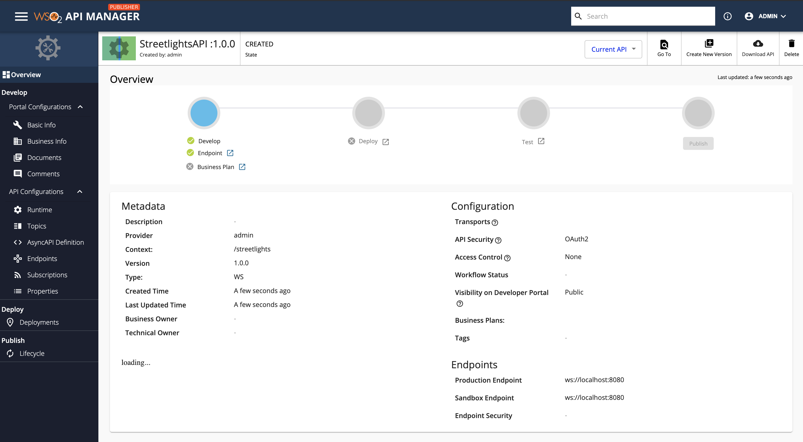
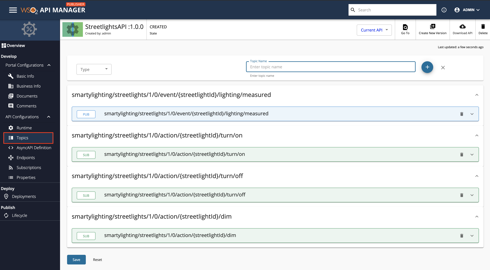

# Create a Streaming API from an AsyncAPI Definition

[AsyncAPI specification](https://www.asyncapi.com/) is a format that describes streaming APIs. An API Creator can import an existing AsyncAPI definition to WSO2 API Manager to create a streaming API using any one of the following protocols.

- [WebSocket](../../../../use-cases/streaming-usecase/create-streaming-api/create-a-websocket-streaming-api/#overview)
- [WebSub (WebHooks)](../../../../use-cases/streaming-usecase/create-streaming-api/create-a-websub-streaming-api/#overview)
- [Server Sent Events (SSE)](../../../../use-cases/streaming-usecase/create-streaming-api/create-a-sse-streaming-api/#overview)

The API Creator can import the existing AsyncAPI definition by either uploading a file or by providing an Async API URL.

Follow the instructions below to create a Streaming API using an AsyncAPI definition for an existing API:

## Step 1 - Design a Streaming API

1. {!includes/sign-in-publisher.md!}

2. Click **CREATE API** and then click **Import AsyncAPI Definition**.

    <html><div class="admonition note">
      <p class="admonition-title">Note</p>
      <p>The <b>CREATE API</b> button will only appear if the user who has signed in has the creator role permission.</p>
      </div>
    </html>

    [](../../../assets/img/design/create-api/streaming-api/design-new-streaming-api.png)

    The following two options to import the AsynAPI definition appears.

	* **AsyncAPI URL** - If you select this option, you need to provide a URL.
	* **AsyncAPI File** - If you select this option, click **Browse File to Upload** and upload a file, which contains an AsyncAPI definition.

3. Select the way in which you are going to import the AsynAPI definition, and click **Next**. 
     
      For this example, let's select **AsyncAPI URL**, provide the following URL, and click **Next**.

     ```sh
     https://raw.githubusercontent.com/asyncapi/asyncapi/master/examples/2.0.0/streetlights.yml
     ```

     <a href="../../../../assets/img/design/create-api/streaming-api/websocket-streaming-api-from-asyncapi-url-import.png"></a>

4.  Edit the Streaming API information and click **Create**.

     <html><div class="admonition note">
      <p class="admonition-title">Note</p>
      <p>The AsynAPI definition of the Streaming API will contain the basic API definition, and <b>will not specify the protocol</b>, such as WebSocket, WebSub, WebHook, SSE, that the API has to use. You need to provide the Streaming API information here.</p>
      </div>
     </html>

      For this example, let's design a WebSocket API using the following information.

      | **Field**   | **Sample value** |
      |-------------|------------------|
      | Name | StreetlightsAPI |
      | Context | /streetlights |
      | Version | 1.0.0 |
      | Protocol | WebSocket (or any other type of Streaming API) |
      | Endpoint | ws://localhost:8080 |
 
      <a href="../../../../assets/img/design/create-api/streaming-api/websocket-streaming-api-from-asyncapi-configure-values.png"></a>

      Now, the **StreetlightsAPI API** overview page will appear.

     [](../../../assets/img/design/create-api/streaming-api/websocket-streaming-api-from-asyncapi-overview.png)

## Step 2 - Configure Topics
   
Click **Topics** to navigate to the topics page.

[](../../../assets/img/design/create-api/streaming-api/websocket-streaming-api-from-asyncapi-topics.png)

You will notice that the topics have been created automatically from the AsyncAPI definition specified in the provided URL.

## Step 3 - View the AsyncAPI Definition

Click **AsyncAPI Definition** under **API Configurations**. 

The AsyncAPI definition of the streaming API, which you just created, appears.
    
   <a href="../../../../assets/img/design/create-api/streaming-api/websocket-view-asyncapi.png"></a>

Now, you have successfully created a Streaming API from an Async API Definition. 

Next, publish the API, for more information, see [Publish an API](../../../../deploy-and-publish/publish-on-dev-portal/publish-an-api).


<div class="admonition note">
<p class="admonition-title">What's Next?</p>
<p>Learn how to create Streaming APIs from scratch by trying out the following tutorials: 
<ul>
<li><a href="../../../../tutorials/streaming-api/create-and-publish-websocket-api">Create and Publish a WebSocket API</a></li>
<li><a href="../../../../tutorials/streaming-api/create-and-publish-websub-api">Create and Publish a WebSub API</a></li>
<li><a href="../../../../tutorials/streaming-api/create-and-publish-sse-api">Create and Publish a Server Sent Events API</a></li>
</ul>
</p>
</div>

## See Also

{!includes/design/stream-more-links.md!}
