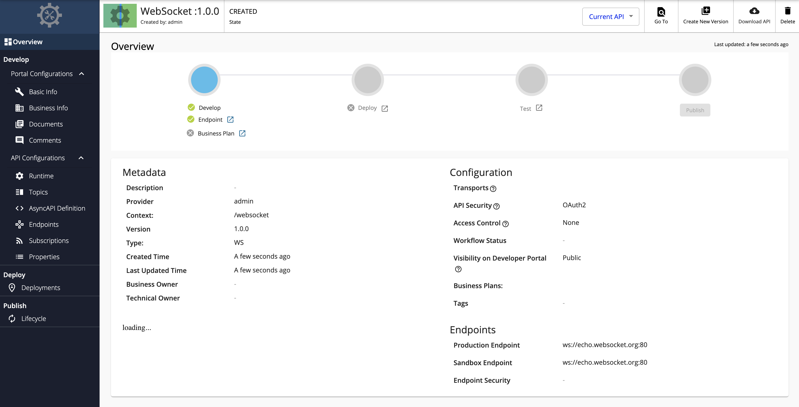

# Create a WebSocket API

## Overview

A WebSocket API is a streaming API in WSO2 API Manager that is implemented based on the [WebSocket](https://www.w3.org/TR/websockets/) protocol specification, which is compatible with HTTP. The WebSocket protocol supports full-duplex communication over a channel that is established once. Therefore, WebSocket protocols allow a continuous two-way communication between the server and the client.

You can create a WebSocket API from scratch in WSO2 API-M and export the WebSocket APIs that are created within WSO2 API-M as AsyncAPI definitions. Alternatively, you can also import [existing AsyncAPI definitions to create SSE APIs in WSO2 API-M](../../../../use-cases/streaming-usecase/create-streaming-api/create-a-streaming-api-from-an-asyncapi-definition).

This section guides you through the process of creating a WebSocket API from scratch in which you can expose a WebSocket backend via WSO2 API Manager. After the API is created, you will be able to create independent channels to connect to each topic in the API. These topics can be mapped to different channels in the backend. As a result, the user can maintain multiple channels with the API to exchange different types of events simultaneously.

## How it works

The WebSocket server can send messages to the WebSocket client, or vice-versa, or both. This is useful in use cases based on the Event Driven Architecture (EDA), where events are sent to be consumed in an asynchronous manner and paving the way for an immediate user experience.

!!! note
    When you create a WebSocket Streaming API it's exposed via both <code>ws</code> and <code>wss</code> protocols. By default, the <code>ws</code> transport uses port 9099, and the <code>wss</code> transport uses port 8099.

## Example usage

For example, chat room applications use WebSocket API so that messages can be sent in a bi-directional manner from the server to the client and vise versa.

## Basic flow

Follow the instructions below to create a WebSocket API using the basic flow:

### Step 1 - Design a WebSocket API

1.  {!includes/sign-in-publisher.md!}

2.  Click **CREATE API**, go to **Streaming API**, and Click **WebSocket API**.

    <html>

      
Note

      
The <b>CREATE</b> button will only appear for a user who has the <code>creator</code> role permission.

      

    </html>

    

3.  Enter the API details.

     <table>
        <colgroup>
             <col/>
             <col/>
             <col/>
        </colgroup>
        <tbody>
             <tr>
                 <th colspan="2"><b>Field</b></th>
                 <th ><b>Sample
          value</b></th>
             </tr>
             <tr>
                 <td colspan="2" class="confluenceTd">Name</td>
                 <td class="confluenceTd">WebSocket</td>
             </tr>
             <tr>
                 <td colspan="2" class="confluenceTd">Context</td>
                 <td class="confluenceTd">
                     

                         

                             <code>/websocket</code>
                         

                         

                             

                                 
The API context is used by the Gateway to identify the API.
          Therefore, the API context must be unique. This context is the API's root context when invoking the API through
          the Gateway.

                             

                             

                                 
                                 

                                     
You can define the API's version as a parameter of its context by
          adding the <code>{version}</code> into the context. For example, <code>{version}/websocket</code>. The WSO2 API-M
          assigns the actual version of the API to the <code>{version}</code> parameter internally. For example,
                                         <code>ws://localhost:9099/1.0.0/websocket</code>. Note that the version appears before the context, allowing you to
          group your APIs based on the versions.

                                 

                             

                         

                     

                 </td>
             </tr>
             <tr>
                 <td colspan="2" class="confluenceTd">Version</td>
                 <td colspan="1" class="confluenceTd">1.0.0</td>
             </tr>
             <tr>
                 <td colspan="2" class="confluenceTd">Protocol</td>
                 <td colspan="1" class="confluenceTd">
                     
WebSocket

                 </td>
             </tr>
             <tr>
                 <td colspan="2" class="confluenceTd">Endpoint</td>
                 <td colspan="1" class="confluenceTd">
                    
Use one of the following endpoints.

                    <ul>
                        <li>ws://echo.websocket.org:80</li>
                        <li>wss://echo.websocket.org:443</li>
                    </ul>
                 </td>
             </tr>
         </tbody>
     </table>

      

4.  Click **CREATE** to create the API.

     The overview page of the newly created API appears.

    

### Step 2 - Configure the Topics

Topics of a WebSocket API are always **Subscribe (sub) and Publish (pub)**, where the flow of events can be either from the server (backend) to the clients or from the client to the server. By default, the WebSocket API will have a topic with the name `/*`.

1. Click **Topics** under **API Configurations** and navigate to the **Topics** page.

2. Modify the topics as follows and click **Save** to update them.

    1. Optionally, click delete as shown below, to delete an existing topic.

        

    2. Select the **Types**, enter the **Topic Name**, and click **+** as shown below, to add a new topic.

        

        The newly added topic is displayed as follows.

        

    3. Optionally, provide a URL Mapping to the topic.

         The provided URL Mapping will be appended to the WebSocket endpoint URL that you provided when creating the API, and the traffic via this topic will be sent to the resulting URL.

         Expand the created topic, provide a URL Mapping and click **Save**.

        

### Step 3 - View the AsyncAPI Definition

Click **AsyncAPI Definition** under **API Configurations**.

The AsyncAPI definition of the streaming API, which you just created, appears.

   

Now, you have successfully created and configured a Streaming API. Next, let's [Publish your API](../../../../deploy-and-publish/publish-on-dev-portal/publish-an-api).

## End-to-end tutorial

Learn more by trying out an end-to-end tutorial on <a href="../../../../tutorials/streaming-api/create-and-publish-websocket-api">Creating and Publishing a WebSocket API</a>, which uses the default Streaming Provider that works with WSO2 API Manager, namely the WSO2 Streaming Integrator.

## See Also

{!includes/design/stream-more-links.md!}
