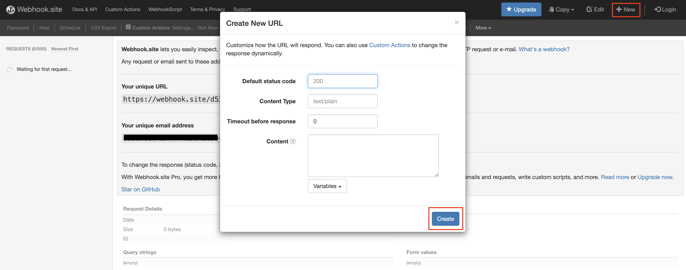
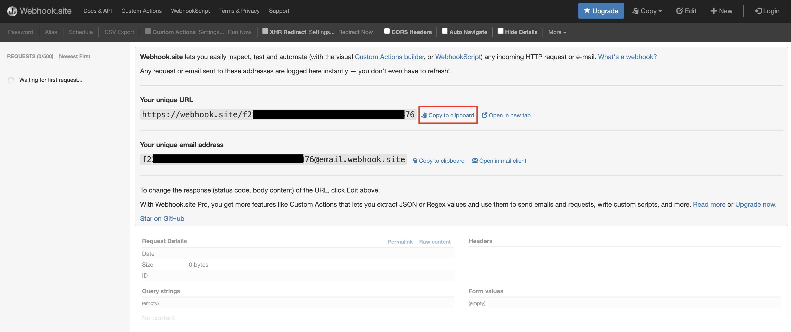

# Test a WebSub/WebHook API

**Testing a WebSub/WebHook Streaming API** refers to the process of trying out a WebSub/WebHook API at the Developer Portal and making sure that the functionalities and behaviors are correctly met.

Follow the instructions below to test a WebSub API (WebHook API):

!!! Prerequisites
     1. The WebSub/WebHook API should have been published.

     2. The WebSub/WebHook API topic should have been registered with your WebHook provider. For more details, see [Create a WebSub/WebHook API](../../../../use-cases/streaming-usecase/create-streaming-api/create-a-websub-streaming-api).

The examples here use the `RepoWatcher` WebSub/WebHook API, which was created in [Create a WebSub/WebHook API](../../../../use-cases/streaming-usecase/create-streaming-api/create-a-websub-streaming-api).

1. {!includes/sign-in-devportal.md!}

2. Click on the WebSub/WebHook API.

      The API overview appears.

3. Click **Try Out** and go to the Try Out section.

4. Generate the access token.

     1. Select **OAuth** as the **Security Type** and select **DefaultApplication** as the **Application**.
     
     2. Select **Production** as the **Key Type**, and click **GET TEST KEY**. 
     
           The access token will be generated.

5. Create a callback URL. 

     1. Go to [https://webhook.site](https://webhook.site).

     2. Click **New**, leave the default values, and click **Create**. 
     
           A unique URL will be created for you. 

           

     3. Click **Copy to clipboard**, which is next to **Your unique URL**.

           

     4. URL-encode the URL, which you have copied.

6. Subscribe to a topic.

      1. Generate the cURL command to subscribe to the topic
      
           Follow the instructions below to generate the cURL command to subscribe to a topic:

           1. Go back to the Developer Portal. 
          
           2. Expand the **/issues** topic.

           3. Select **Subscribe**.

           4. Provide the encoded callback URL which you have obtained in the previous step, as the **Callback URL**.

           5. Click **GENERATE CURL**. The cURL command will be generated.

           6. Copy the generated cURL command, paste it into a terminal, and execute it.

      2. Click **Subscriptions** to go to the Subscriptions page of your application in the Developer Portal. 

      3. Click on the WebSub/WebHook API's subscription entry.

           This lists down the subscription you just made.

           You have now registered the given callback URL with the **/issues** topic. Triggering your WebHook will send an event to the callback URL.

7. Unsubscribe from a topic.

     1. Generate the cURL command to unsubscribe from a topic.

           Follow the instructions below to generate the cURL command to unsubscribe from a topic:

           1. Expand the **/issues** topic in the Developer Portal.

           2. Select **Unsubscribe**.

           3. Provide the encoded callback URL which you have obtained previously, as the **Callback URL**.

           4. Click **GENERATE CURL**. 
          
               The cURL command will be generated.

           5. Copy the generated cURL command, paste it into a terminal, and execute it.

      2. Click **Subscriptions** to go to the Subscriptions page of your application in the Developer Portal again. 

      3. Click on the WebSub/WebHook API's subscription entry.

          The subscription you made previously will not be displayed in the list anymore.

          You have now unsubscribed the given callback URL from the **/issues** topic.

