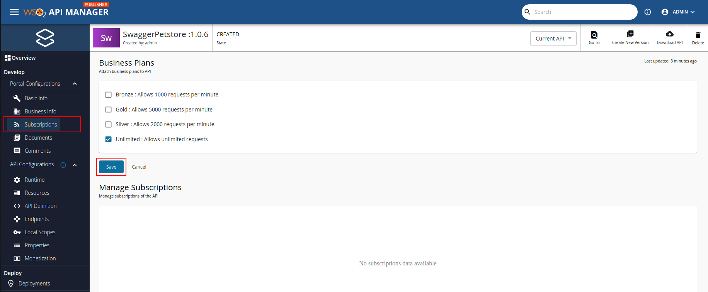
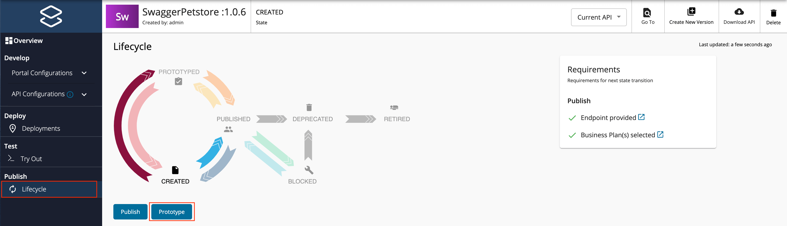

## Step 3 - Deploy the API

[Deploy the API](../../../../deploy-and-publish/deploy-on-gateway/deploy-api/deploy-an-api/) in order to make the API available in the respective Gateway.

## Step 4 - Test the API via the Publisher

Once deployed to the Gateway, you can [test the REST type APIs via the Publisher Portal](../../../../../design/create-api/create-rest-api/test-a-rest-api/).

## Step 5 - Publish the API as a Prototype

!!! important
		- By default, from WSO2 API Manager 4.1.0 onwards, security is enabled for all the resources of the Prototype API. As a result, you need a subscription to invoke the API.
    - Skip this step if you have [disabled security](../../../../design/api-security/api-authentication/disable-security/) for all the resources in the API.

		Follow the instructions below to attach Business Plans to the API.

		1. Navigate to **Portal Configurations** and click **Subscriptions**.

		2. Select the required Business Plans and click **Save**.

    

Follow the instructions below to publish the API to the Developer Portal as a Prototype:

1. Navigate to the **Lifecycle** page listed under **Publish**.  
    
    For both options, **When creating an API with the Mock Implementation** and **When creating an API with an actual backend URL**, you will have the option to either promote your API to the **PRE-RELEASED** state or to the **PUBLISHED** state in the API lifecycle.

    

2. Click **Pre-Release** to publish the API as a Prototype API to the Developer Portal.