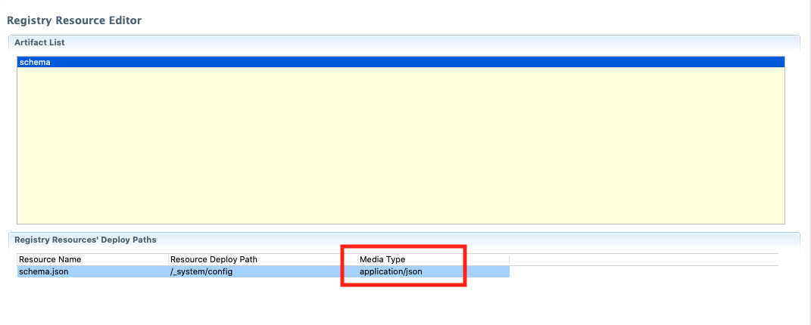

!!! Info "Before you begin"
		Note the following:

	-	The Micro Integrator uses a [file-based registry](../../../install-and-setup/setup/mi-setup/deployment/file_based_registry) instead of a database (which is used in your WSO2 EI version). 
	-	Your WSO2 EI registry may have the following partitions: <b>Local</b>, <b>Config</b>, and <b>Gov</b>. However, you only need to migrate the <b>Config</b> and <b>Gov</b> registry partitions. See the instructions on configuring [registry partitions in the Micro Integrator](../../../install-and-setup/setup/mi-setup/deployment/file_based_registry).
	-	Message processor tasks stored in the registry should be stored with a new naming convention in the Micro Integrator. Therefore, all entries in the registry with the `MSMP` prefix (which correspond to message processor tasks) should not be migrated to the Micro Integrator. New entries will be automatically created when you start the Micro Integrator server.
	-	If you have shared the registry of your WSO2 EI among multiple nodes, you can do the same for the file-based registry of the Micro Integrator. However, note that registry mounting/sharing is only required for [**persisting message processor states** among nodes of the Micro Integrator](../../../install-and-setup/setup/mi-setup/deployment/deploying_wso2_ei/#registry-synchronization-sharing).
	
	
You can migrate the registry resources by using the **registry migration tool** as follows:

1. Download the [tool](https://github.com/wso2-docs/WSO2_EI/blob/master/RegistryMigration-EI6.x.xtoMI/registry-migration-service-1.0.0.jar) and save it to a location on your computer.

2. Execute one of the commands given below to start the tool.

	-	To start the tool without a log file:

		```bash
		java -jar <path_to_jar>/registry-migration-service-1.0.0.jar
		```

	-	To start the tool with a log file:

		!!! Tip
			Replace `<log_file_location>` with the location where you want the log file to be created.

		```bash
		java -Dlog.file.location=<log_file_location> -jar <path_to_jar>/registry-migration-service-1.0.0.jar
		```

3. Specify the following input values to log in to your WSO2 EI server from the migration tool:

	<table>
		<tr>
			<th>
				Input Value
			</th>
			<th>
				Description
			</th>
		</tr>
		<tr>
			<td>
				EI Server URL 
			</td>
			<td>
				Specify the EI server URL with the servlet port. The default is <code>https://localhost:9443</code>.
			</td>
		</tr>
		<tr>
			<td>
				Internal Truststore Location of the EI Server
			</td>
			<td>
				Specify the location of the internal truststore used by the EI server.
			</td>
		</tr>
		<tr>
			<td>
				Internal Truststore Type of EI Server
			</td>
			<td>
				Specify the type of the internal Truststore used by the EI server. The default is <code>JKS</code>.
			</td>
		</tr>
		<tr>
			<td>
				Internal Truststore Password of EI Server
			</td>
			<td>
				Specify the password of the internal Truststore used by the EI server. The default is <code>wso2carbon</code>.
			</td>
		</tr>
		<tr>
			<td>
				Username of the EI Server
			</td>
			<td>
				<code>admin</code>.
			</td>
		</tr>
		<tr>
			<td>
				Password of the EI Server
			</td>
			<td>
				<code>admin</code>.
			</td>
		</tr>
	</table>

4.	Select one of the following options and proceed.

	<table>
		<tr>
			<th>
				Option
			</th>
			<th>
				Description
			</th>
		</tr>
		<tr>
			<td>
				Export as a Registry Resource Module
			</td>
			<td>
				<b>Recommended</b>. If you select this option, the registry resources are exported as a Registry Resources module, which you import to WSO2 Integration Studio. You can then create a CAR file by selecting resources from the registry resources module.
			</td>
		</tr>
		<tr>
			<td>
				Export as a Carbon Application
			</td>
			<td>
				If you select this option, the registry resources in your WSO2 EI instance are exported as a single CAR file, which you directly copy to your Micro Integrator distribution.
			</td>
		</tr>
	</table>

5.	Specify input values depending on which export option you selected.

	-	If you selected **Export as a Registry Resource Module**, follow the steps given below.

		1. Enter the following input values:

			<table>
				<tr>
					<th>
						Input Value
					</th>
					<th>
						Description
					</th>
				</tr>
				<tr>
					<td>
						Integration Project Name
					</td>
					<td>
						Specify the name of the Integration project.
					</td>
				</tr>
				<tr>
					<td>
						Project’s Group ID
					</td>
					<td>
						Specify the group ID of the integration project. The default value is <code>com.example</code>.
					</td>
				</tr>
				<tr>
					<td>
						Project’s Artifact ID
					</td>
					<td>
						Specify the artifact ID of the integration project. The default value is the integration project name.
					</td>
				</tr>
				<tr>
					<td>
						Project Version
					</td>
					<td>
						Specify the version of the integration project. The default value is <code>1.0.0</code>.
					</td>
				</tr>
				<tr>
					<td>
						Export Location
					</td>
					<td>
						Specify the location where the integration project should be created.
					</td>
				</tr>
			</table>

		2.	Verify the following:

			-	If the process is successful, the **Registry Resource Project** is created in the location you specified. 
			-	A summary report is created at the export location with file name: `registry_export_summary_<date>.txt`. This report explains whether the registry resource is successfully exported and also provides reasons in case the exprot fails.

		3. [Import the Registry Resource Project](../../../integrate/develop/creating-artifacts/creating-registry-resources/#import-from-file-system) to the Registry Resources module in WSO2 Integration Studio.

		4.	Open the resource editor and make sure that the <b>media type</b> of the resource is set properly.
			
			

		5. Select the required resources from your registry resources project and export a CAR file.

	-	If you selected **Export as a Carbon Application**, enter the following input values:

		<table>
			<tr>
				<th>
					Input Value
				</th>
				<th>
					Description
				</th>
			</tr>
			<tr>
				<td>
					CAR File Name
				</td>
				<td>
					Specify the name of the Carbon application.
				</td>
			</tr>
			<tr>
				<td>
					CAR File Version
				</td>
				<td>
					Specify the version of the Carbon application. The default value is <code>1.0.0</code>.
				</td>
			</tr>
			<tr>
				<td>
					Export Location
				</td>
				<td>
					Specify the location where the CAR file should be created.
				</td>
			</tr>
		</table>

	You should now have a CAR file with the required registry resources.

6.	Copy the CAR file to the `<MI_HOME>/repository/deployment/server/carbonapps` folder.