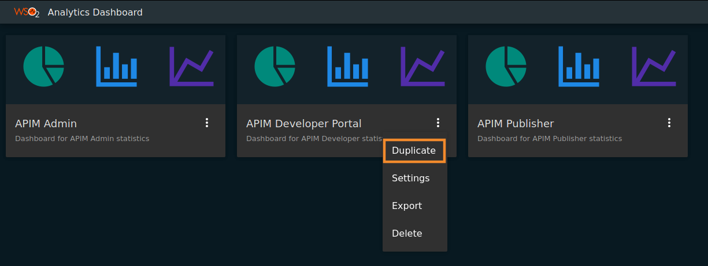
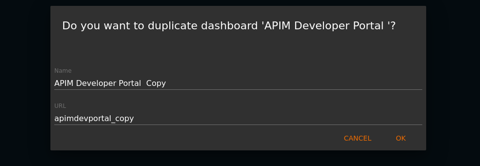
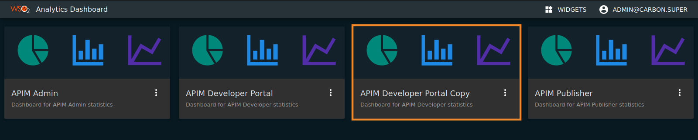
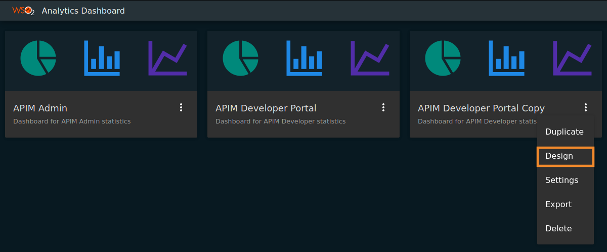

#Customizing Analytics Dashboards

API Manager analytics provides five different dashboards which are API Analytics, Application Analytics, Business Analytics, Monitoring and Reports.

The users will not be allowed to modify the default dashboards, i.e either to modify the layout of the widget or add custom widgets to a particular dashboard. If it is required to modify one of the default dashboards, a copy of the dashboard should be created and the modification should be applied to that copy as described below.

1.  Click on the button at the lower right corner of the dashboard card that needs to be customized as shown below.

    
    
2.  A dropdown menu will appear as shown below and click the `Duplicate` button from the dropdown.
    
    
    
3.  A form will be displayed as shown below. Add a valid `Name` and `URL` for the dashboard according to the preference and click the `ok` button.

    
    
4.  Now a copy of the dashboard is created with the provided `Name` as shown below.
    
    
    
5.  Click the dropdown button at the lower right corner of the created dashboard card and click the `design` button as shown below.
    
    
    
6.  Now it will be directed to the design portal where the customization of the selected dashboard can be done.