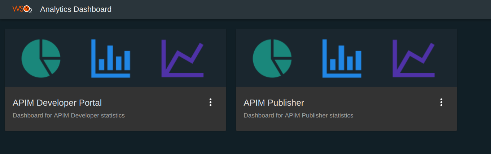

# Managing Analytics Dashboard Permissions

From API-M Analytics 3.0.0 release onwards, Publisher and Developer Portal statistics are moved out from the Publisher and Developer portal apps.
And those can be viewed using the **dashboard** runtime of the API-M Analytics server.

This section explains about managing permissions of each of these dashboards.

## Permission Levels of a Dashboard
A dashboard has three levels of permissions.

+ **Owners** - Owners of a dashboard are the most privileged users of the dashboard. Only they have access to settings page once access control is set. They also can edit or view the dashboard.
+ **Editors** - Editors of a dashboard can either edit the dashboard or view the dashboard. Editing the dashboard includes adding / removing widgets, add / remove pages to the dashboard, changing the layout of the dashboard etc. 
But they don’t have access to the dashboard settings page.
+ **Viewers** - Viewers of a dashboard are the least privileged users of a dashboard. The can only view the dashboard and cannot edit or change the settings of a dashboard.

## Configuring Dashboard Permissions
Now let's see how we can change the default permissions that is set for each of these dashboards.

+ Log in to the Analytics Dashboard by accessing `<Protocol>://<Host>:<Port>/analytics-dashboard` (ex: [https://localhost:9643/analytics-dashboard](https://localhost:9643/analytics-dashboard)). 
+ After login in, you will see the **APIM Publisher** and the **APIM Developer Portal** dashboards listed.
  
       

+ Click on the three dots at the bottom right corner of the preferred dashboard card and select **Settings**

       
     
!!! Note
      Settings option will be visible only if you have owner permission of the selected dashboard.
      
+ The Dashboard Settings page opens and you can assign scopes for different permission levels.

      
      
!!! Info
      List of available scopes will be populated for each permission level. Dashboard owners can set the required scopes for each of those permission levels. Each permission level can have multiple scopes.

