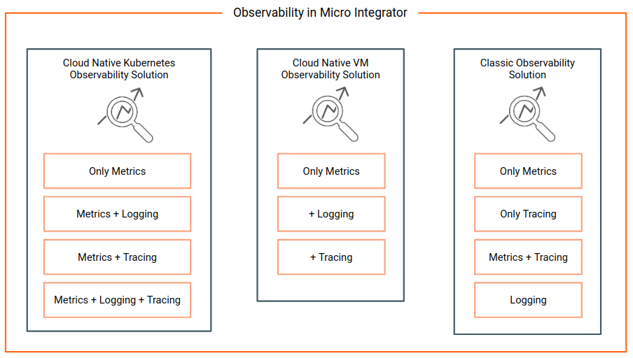

# Observe and Manage Overview

This section explains how to set up the observability solutions and perform management tasks for WSO2 Enterprise Integrator.

## API Analytics

APIs are widely used in Business Integrations and are becoming a key part of driving an Organization's Business strategy. Ensuring the proper functioning of the APIs, getting feedback on the performance and deriving business insights from APIs are becoming equally important. WSO2 API Manager Analytics does this by integrating with WSO2 API Manager to provide statistics, reports, and graphs on the APIs deployed in WSO2 API Manager. It further allows configuring Alerts to notify about unusual behaviours and error conditions in near real-time.

In order to make the data easily available, WSO2 API Manager Analytics offers different Dashboards that show different views of the APIs to different user groups. Application Developers, API Publishers, DevOps and Program Managers can use these Dashboards to learn about different perspectives of the underlying API ecosystem. The following image shows the default Dashboards available in WSO2 API Manager Analytics.

**Business Analytics** - Provides long-term historical trends about API Latency, Traffic Volume, Errors, and other statistics like most used APIs, API Subscribing frequency, and Developer Sign-Ups over time that shows different aspects of the API adoption. This is targeted for Program Managers who need to see a holistic view of the APIs, Developers, and Application and shows data about all APIs without any restriction. The internal/analytics role is needed to view this Dashboard.

**Application Analytics** - Provided for Application Developers to view the statistics related to their Applications. A user needs to have the internal/subscriber role to view this Dashboard. Please note that what’s shown in the Dashboard are statistics for Apps created by the viewer assuming a Developer role. This includes registered application users, top application users, API usage of an application, etc.

**API Analytics** - Provided for the API creators to view the statistics related to their APIs. This provides the ability to compare and contrast the usage of different APIs created by the logged-in user. Further provides the performance and fault statistics of individual APIs. When an API is restricted to a Publisher it wouldn’t appear under this Dashboard. The internal/publisher role is needed to view this Dashboard.

**Monitoring** - Provides a short-term historical view about Latency, Traffic Volume, and Errors of APIs with drill-downs to narrow down errors and isolate the cause of the issues. This dashboard is targeted for DevOps and SysAdmins who overlook the health and availability aspects of the APIs. Currently, the internal/analytics role is needed to view this Dashboard. But a different role can be assigned by editing role mappings as described in [Managing Analytics Dashboard Permissions]({{base_path}}/learn/analytics/managing-dashboard-permissions)

**Reports** - This can be used to accomplish the API monetization use cases. Currently, this is restricted to users with admin role only. Users can download a PDF report of the API usage statistics for the selected month. Later this report can be used for billing purposes. You can customize the format and structure of this Dashboard as described in [Monthly API Usage Report]({{base_path}}/learn/analytics/monthly-api-usage-report/#customizing-the-report)

!!! note
    Apart from these default Dashboards, users can create custom Dashboards according to their specific requirements as described in [Customizing Analytics Dashboards]({{base_path}}/learn/analytics/customizing-analytics-dashboards).

## Observability

Observability can be viewed as a superset of monitoring where monitoring is enriched with capabilities to perform debugging and profiling through rich context, log analysis, correlation, and tracing. Modern day observability resides on three pillars of **logs**, **metrics**, and **tracing**. Modern businesses require observability systems to self-sufficiently emit their current state(overview), generate alerts for any abnormalities detected to proactively identify failures, and to provide information to find the root causes of a system failure.

### Observability solutions

WSO2 API Manager offers two observability solutions referred to as the cloud-native observability deployment and classic observability deployment.

The cloud-native and classic observability solution are suitable for the following combination of operations.

<table>
    <tr>
        <th>Observability solution</th>
        <th>Operations</th>
        <th>Description</th>
    </tr>
    <tr>
        <td>Kubernetes cloud-native solution</td>
        <td>
            <ul>
                <li>Metrics only</li>
                <li>Metrics + Logging</li>
                <li>Metrics + Tracing</li>
                <li>Metrics + Logging + Tracing</li>
            </ul>
        </td>
        <td>The default Kubernetes cloud-native solution comes with metrics enabled. You can also configure logging and tracing in combination with this. This solution is ideal if you want a complete cloud-native solution to observability and you already have Prometheus, Grafana, and Jaeger as your in-house monitoring and observability tools.</td>
    </tr>
    <tr>
        <td>VM cloud-native deployment</td>
        <td>
            <ul>
                <li>Metrics only</li>
                <li>Logging (add-on)</li>
                <li>Tracing (add-on)</li>
            </ul>
        </td>
        <td>The default VM cloud-native solution comes with metrics enabled. You can additionally set up logging or tracing separatly as part of this solution later. This solution is ideal if you want a complete cloud-native solution to observability, but you need to set this up on a VM. Ideally you would already have Prometheus, Grafana, and Jaeger as your in-house monitoring and observability tools.</td>
    </tr>
    <tr>
        <td>Classic deployment</td>
        <td>
            <ul>
                <li>Metrics only</li>
                <li>Tracing only</li>
                <li>Metrics and Tracing</li>
                <li>Logging separately</li>
            </ul>
        </td>
        <td>This solution uses the Analytics profile of WSO2 EI 6.x.x and if can be configured to have metrics and tracing by enabling them once set up. You will have to configure logging separately by setting it up in the Micro Integrator itself. This is useful if you require more business analytics and less operation observability and also if you already have an observability stack such as ELK.. This is a more simpler solution.</td>
    </tr>
</table>

* For instructions to set up the above observability solutions, see [Setting Up the cloud-native observability solutions](../setup/observability/setting-up-minimum-basic-observability-deployment.md) or [Setting up classic observability solution](../setup/observability/setting-up-classic-observability-deployment.md)

* For more information on how to use the cloud-native solution, see [Cloud Native Observability Solution](cloud-native-observability-dashboards.md).

* For more information on how to use the classic observability solution, see [Classic Observability Deployment](using-the-analytics-dashboard.md).

### Understanding observability solutions

WSO2 Enterprise Integrator 7.0.0 and older versions offer an analytics distribution that mainly provides business analytics functionality together with a few observability related features. Clients with comprehensive observability requirements had to rely on external tools/stacks such as ELK, Prometheus, AppDynamics, Jaeger, Zipkin, etc. This resulted in multiple scattered systems to observe the system where debugging and troubleshooting were not sufficiently stream-lined.

To address that limitation, WSO2 Enterprise Integrator 7.1.0 introduced an observability solution that utilizes a selected set of external tools together with the older analytic distribution intact. This section explains the features and usage of both solutions. 

The older analytics distribution is referred to as the Classic Observability Deployment, and the newer solution introduced with WSO2 Enterprise Integrator 7.1.0 is referred to as the Cloud Native Observability Deployment.

## Management

You can monitor and manage various artifacts that you have deployed. The following are the options that enable you to do this.

- **[Micro Integrator Dashboard](working-with-monitoring-dashboard.md)**: Allows you to perform administration tasks related to your Micro Integrator deployment
- **[Micro Integrator CLI](using-the-command-line-interface.md)**: Allows you to perform various management and administration tasks from the command line.
- **[Using the Management API](working-with-management-api.md)**: The Micro Integrator CLI and the Micro Integrator dashboard communicate with this service to obtain administrative information of the server instance and to perform various administration tasks. If you are not using the dashboard or the CLI, you can directly access the resources of the management API

## Integration with external tools

You can integrate with external tools to do the following.

**Monitoring Metrics**

- [JMX Monitoring](jmx_monitoring.md)
- [SNMP Monitoring](snmp_monitoring.md)

**TCP Message Monitoring**

- [Starting TCPMon](tcp/starting_tcp_mon.md)
- [Message Monitoring with TCPMon](tcp/message_monitoring_with_tcpmon.md)
- [Other Usages of TCPMon](tcp/other_usages_of_tcpmon.md)
