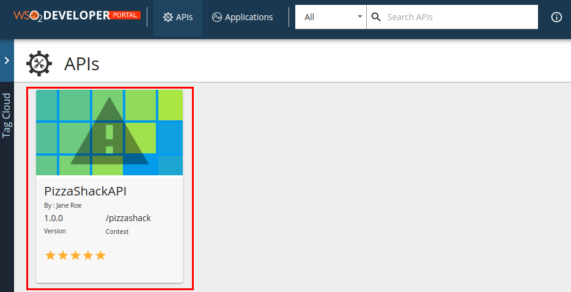
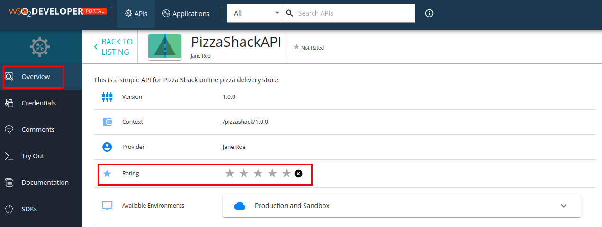
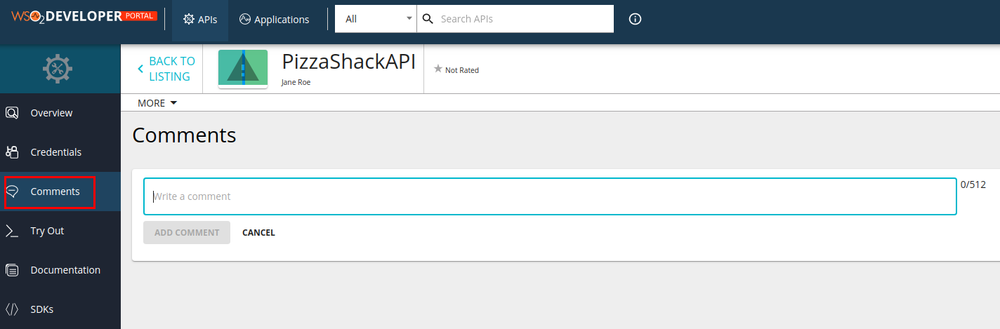
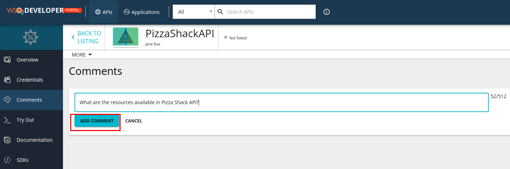
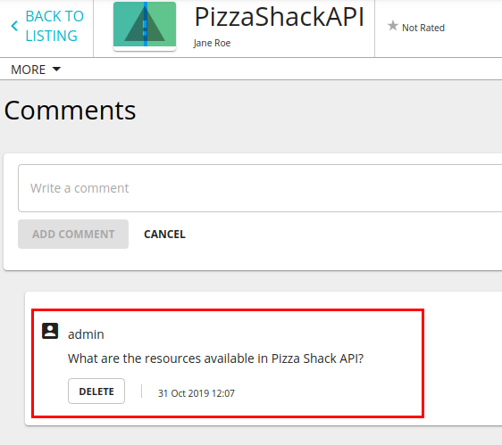

# Use the Community Features

The Developer Portal provides several useful features to build and nurture an active community of users, for your APIs. This is required to advertise APIs, learn user requirements and market trends.

Let's see what community features are available in the Developer Portal:

-   [Use the search facility](#use-the-search-facility)
-   [Rate and comment](#rate-and-comment)

#### Use the search facility

You can search for APIs in the API Publisher or Developer Portal. To check more details refer [API Search page](../discover-apis/search.md).

#### Rate and comment

Rates and comments give useful insights to potential API consumers on the quality and usefulness of an API. You can rate and comment on each API version.

1.  Log in to the Developer Portal and click on a published API.
    
2.  The API's **Overview** page opens. Note the rating options there:
    
3.  Add a rating.
    
4.  Go to **Comments** tab.
    
5.  Type a comment and click **Add Comment**.
    
6.  Note that the comments appear sorted by the time they were entered, alongside the author's name.
    
7.  You can also check the comments in the **Overview** page.
     
