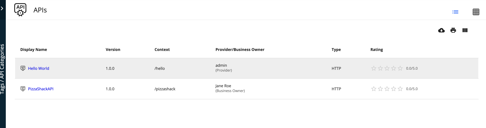

# Change Default View

By default the API Listing view is a grid view. You can follow the steps below to change the default API listing to a table view by configuring `defaultTheme.js`.

The `defaultTheme.js` file has all the parameters defining the look and feel of the developer portal. To learn more about `defaultTheme.js` refer [here]({{base_path}}/learn/consume-api/customizations/customizing-the-developer-portal/overriding-developer-portal-theme/#overriding-the-default-theme).

1. Open the `<API-M_HOME>/repository/deployment/server/jaggeryapps/devportal/site/public/theme/defaultTheme.js` file in a text editor.

    Make sure to take a backup of the `defaultTheme.js` before making any changes.
    
    If you want to change it to the listing view, set the `themes.light.custom.defaultApiView` attribute value to `list`.
    
    Changes done in the `defaultTheme.js` will be reflected directly in the developer portal. (It is not required to restart the server or rebuild the source code)

2. Refresh the Developer Portal to view the changes.

    

