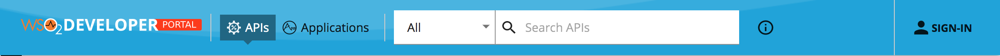
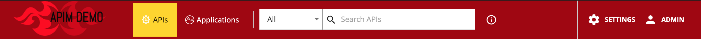

# Changing the Logo and Header Styles

The header section can be customized to match different design needs. Following is the default look and the configuration.

  

!!! note
    -   You can find the default configurations at the `<API-M_HOME>/repository/deployment/server/jaggeryapps/devportal/site/public/theme/` in `defaultTheme.js` file.
    -   Make sure to take a backup of the `defaultTheme.js` before making any changes.
    -   Using the above file as reference you can override the parameters defined in the that file by altering the parameters in `defaultTheme.js` file.

```js
appBar: {
    logo: '/site/public/images/logo.svg',
    logoHeight: 19,
    logoWidth: 208,
    background: '#1d344f',
    activeBackground: '#254061',
    showSearch: true,
    drawerWidth: 200,
},
```
#### Example

We can change the logo and header background as follows by changing the above parameters.
  

```js
 appBar: {
    logo: '/site/public/images/custom-logo.png',
    logoHeight: 66,
    logoWidth: 200,
    background: '#a10207',
    activeBackground: '#ffd500',
    showSearch: true,
    drawerWidth: 200,
},
```

| Option | type | Description |
| ------ | -- | ----------- |
| logo | string | Relative path to logo |
| logoHeight | integer | Logo height in pixels |
| logoWidth | integer | Logo width in pixels |
| background | string | Background color of the header |
| activeBackground | string | Background color of the selected header menu item |
| drawerWidth | integer | Small resolutions will collopse the top menu in to a toggle drawer. This property sets the it's width in pixels |