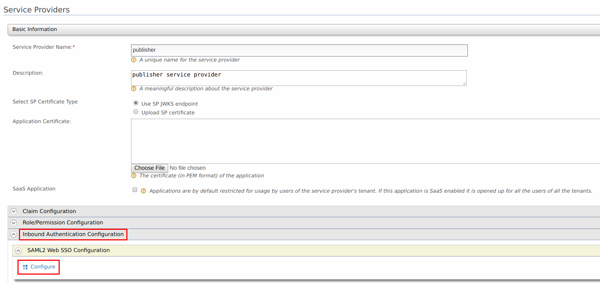
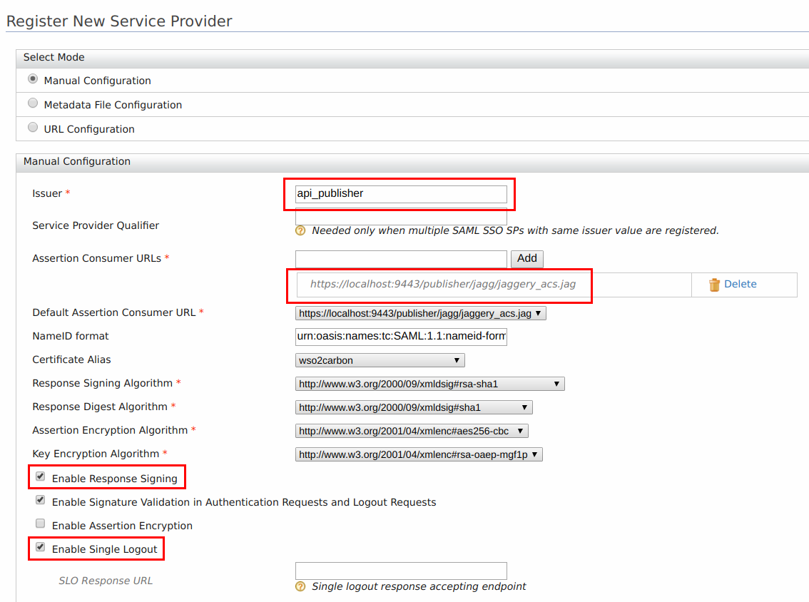
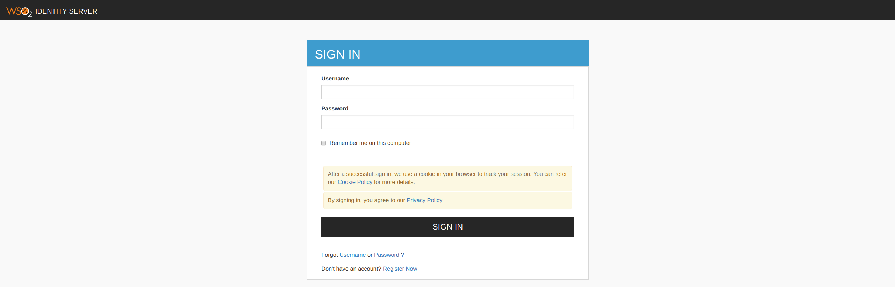
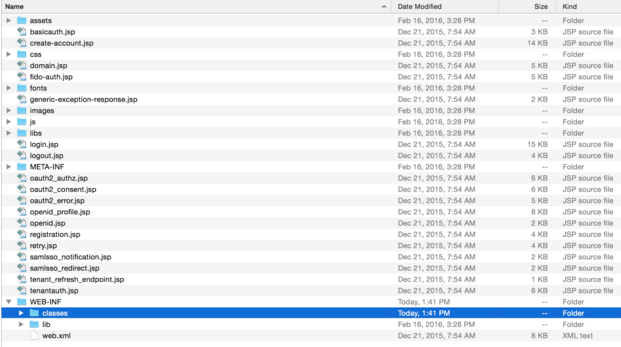
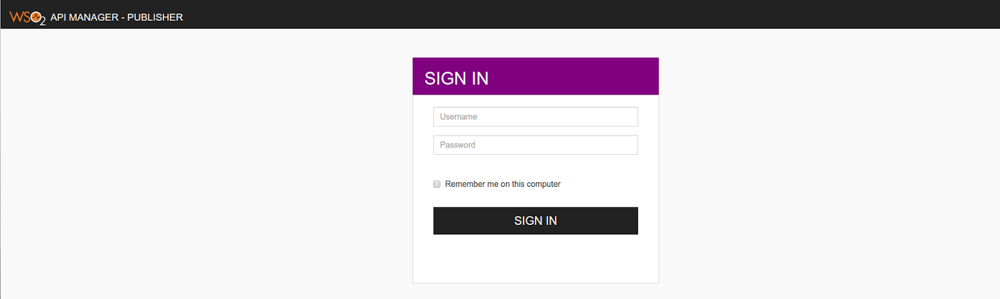

# Customizing Login Pages for Developer Portal and Publisher

Custom pages for logging into the server are available for SAML2 SSO, OAuth and OpenID. This section guides you through this customization.

The login pages and other pages like error and notification screens of SAML SSO, OAuth, OpenID and Passive STS are located in the authenticationendpoint webapp file found at `<APIM_HOME>/repository/deployment/server/webapps`.

You can easily customize these pages within this web application by changing the respective JSPs, JavaScript and CSS. If you want to point to a different web application, you can do so by redirecting or forwarding from **authenticationendpoint** to your webapp. In the case of SAML SSO, the `issuer` id of the service provider is also sent to this webapp. Therefore, different login pages can be given to different service providers by looking at the `issuer` request parameter.

The following is a sample of how to customize the login page for SAML2 SSO.

### Customizing the login page for SAML SSO service providers

Usually WSO2 API Manager displays a default login page for all the SAML SSO service providers that send authentication requests to it. The following steps indicate how to change the default login page into a customized one.

#### Registering the two service providers in the Identity Server

1.  Download [WSO2 Identity Server](http://wso2.com/products/identity-server/) and extract it.

2.  [Run the server](https://is.docs.wso2.com/en/next/setup/running-the-product/) by executing `/bin/wso2server.sh` if on a Unix-based systems, or `/bin/wso2server.bat` if on Windows.

3.  On the [management console](https://is.docs.wso2.com/en/next/setup/running-the-product/#accessing-the-management-console), click **Add** under **Service Providers** in the **Main** menu.

4.  Enter `publisher` as the **Service Provider Name** in the form that appears and click **Register**.

    

5.  In the page that appears next, expand the **Inbound Authentication Configuration** section and the **SAML2 Web SSO Configuration** section. Click **Configure** . The **Register New Service Provider** page appears.

    
    
    Configure the following details for publisher.

    -   **Issuer** : api\_publisher

    -   **Assertion Consumer URL** : `https://<application-host-name>/<redirection-path>`

    -   Select Enable Response Signing

    -   Select Enable Single Logout

    

6.  Repeat steps 1 to 5 and configure the following details for Developer Portal.

    -   **Issuer** : api\_devportal

    -   **Assertion Consumer URL** : `https://<application-host-name>/<redirection-path>`

    -   Select Enable Response Signing

    -   Select Enable Single Logout

7.  When attempting to login with SAML from WSO2 Identity Server in Publisher and Developer Portal, you can see the following default page located at `<IS_HOME>/repository/deployment/server/webapps/authenticationendpoint/login.jsp          `

     For instructions on configuring WSO2 Identity Server as an identity provider, see [Configuring Identity Server as IDP for SSO](/administer/product-security/saml2-sso/configuring-identity-server-as-idp-for-sso/) .

#### Configuring the login page

##### Understanding the authenticationendpoint web application

The login page that is displayed during SAML2 SSO, OAuth, OpenID and Passive-STS flows is located inside the webapp named authenticationendpoint. The reason for storing this in a web app is:

-   to easily customize the page according to user requirements

-   if needed, place that whole web application in an external application server

The Identity Server knows the location of this web application as it is specified in the `<IS_HOME>/repository/conf/identity/application-authentication.xml` configuration file. This is referenced as shown below.

```xml
<AuthenticationEndpointURL>/authenticationendpoint/login.do</AuthenticationEndpointURL>
<AuthenticationEndpointRetryURL>/authenticationendpoint/retry.do</AuthenticationEndpointRetryURL>
```

By default it points to a location inside the Identity Server itself, thus the relative path is given. If it is necessary to point to an external application, the full path should be given instead.

!!! info
      If this web app is moved outside the Identity Server, we must ensure that no one can access the login credentials that are passed between this application and the Identity Server. This means that the external location should ideally be either inside a secured intranet or the transport should be HTTPS. Other similar precautions may be necessary to secure the communication.

The following is the structure of this web app.



The **authenticationendpoint** web application uses a carbon component called `org.wso2.carbon.identity.application.authentication.endpoint.util.` This bundle includes a filter called the `org.wso2.carbon.identity.application.authentication.endpoint.util.filter.AuthenticationEndpointFilter` , which acts as the Front Controller.

When a request is made to the **authenticationendpoint** web application, based on the authentication protocol type identified by the request parameter `type`, the controller first forwards the request to the protocol based login url patterns defined. For example, if the request to the **authenticationendpoint** web application is initiated as a result of a SAML SSO authentication request, the controller will forward the request to the url pattern `/samlsso_login.do` . If you look inside the **web.xml** , you will see that this url pattern is mapped to the **login.jsp** file. The request is finally forwarded to this **login.jsp** page.

Everything on the **authententicationendpoint** web application is customizable. You can customize it by adding JSP pages or modifying them and configuring the web.xml respectively.

The only restriction involved is that the content already sent back by the pages inside the default web app must be submitted to the Identity Server. Additionally, you must point to the correct location via the `<IS_HOME>/repository/conf/identity/application-authentication.xml` file.

##### Customizing the login page

When a request comes to the default login page, you can see several parameters being passed in the address bar. For this customization, the focus is on the following two parameters:

-   **sessionDataKey** : This is an identifier used by the Identity Server to maintain state information related to this particular request by the service provider.

-   **relyingParty** : This is the value we gave for the "Issuer" field when we registered the SAML2 SSO service provider (e.g., [travelocity.com](http://travelocity.com) ). This value is used to display different login pages to different service providers.

When customizing the pages, ensure that the following is applied.

1.  Form submissions should happen to the **commonauth** servlet as a POST.
`<form id="form" name="form" action="../../commonauth" method="POST">          `

2.  Make sure to send back the **sessionDataKey** with the form submission, by using a hidden input field.
`<input type="hidden" name="sessionDataKey" value="<%=request.getParameter("sessionDataKey")%>"/>          `

##### Using a JSP to redirect to SP relevant pages

1.  Rename the existing `login.jsp` to `default_login.jsp`.

2.  Create a new file with the name `login.jsp` including the following code.

    ```jsp
    <%
      String relyingParty = request.getParameter("relyingParty");
      if (relyingParty.equals("api_publisher")) {
      RequestDispatcher dispatcher = request.getRequestDispatcher("publisher_login.jsp");
      dispatcher.forward(request, response);
      } else if (relyingParty.equals("api_devportal")) {
        RequestDispatcher dispatcher = request.getRequestDispatcher("devportal_login.jsp");
        dispatcher.forward(request, response);
      }
      else {
      RequestDispatcher dispatcher = request.getRequestDispatcher("default_login.jsp");
      dispatcher.forward(request, response);
      }
    %>
    ```
    This code snippet forwards the request to a different login page by checking the value of **relyingParty** parameter.

3.  Get the `publisher_login.jsp` from [here](https://svn.wso2.org/repos/wso2/people/roshan/) and place it at the same level as `login.jsp`. Also, download the contents of the `css` folders from that same link and put them inside the respective folders in the authenticationendpoint.

4.  Log in to the publisher web app again. You are presented with a different page.

    

5.  Follow steps 1 to 4 to configure the custom login page to the Developer Portal web app.

#### Customizing different sections of identity server related JSP pages

It is possible to customize different sections like header and footer in the JSP pages including `Login` and `Signup` in API Manager.

The JSP pages in the following webapps can be customized.

- `<API-M_HOME>/repository/deployment/server/webapps/authenticationendpoint`
- `<API-M_HOME>/repository/deployment/server/webapps/accountrecoveryendpoint`

The following sections in a web page are made extensible.

1. **Title**
2. **Header**
3. **Footer**
4. **Cookie Policy Content**
5. **Privacy Policy Content**

Follow the steps below to customize them.

1. Create a folder named **extensions** in `<API-M_HOME>/repository/resources` directory.

2. Copy the files that you need to customize, into the new **extensions** folder from the **includes** folder which is available in `<API-M_HOME>/repository/deployment/server/webapps/authenticationendpoint` directory.

    You can choose from `product-title.jsp`, `header.jsp`, `product-footer.jsp`, `cookie-policy-content.jsp` and `privacy-policy-content.jsp`. If you copy the **header.jsp**, please make sure to copy the **product-title.jsp** file as well.
    
    !!! info
        In order to copy any logos or images, create a folder named **customAssets** inside the extensions folder with your asset files.
    
    !!! note
        If you are creating your own pages instead of copying from the **includes** folder, make sure to name the respective files as `product-title.jsp`, `header.jsp`, `product-footer.jsp`, `cookie-policy-content.jsp` and `privacy-policy-content.jsp`.

3. Customize those copied files with your content.
    
    For example, if you want to customize the header, footer and title sections of the login and signup pages of WSO2 API Manager, change or edit the **headerTitle**, **pageTitle** and **footerText** in the following lines in `header.jsp` file with your content. If you are doing this, please make sure to add the `product-title.jsp` file to the extensions folder along with the `header.jsp` file.

    ``` tab="Example"
        String headerTitle = "API Manager";
        String pageTitle = "WSO2 API Manager";
        String footerText = "WSO2 API Manager";
        String faviconSrc = "libs/theme/assets/images/favicon.ico";
        String logoSrc = null;
        String logoHeight = "50";
        String logoWidth = "50";
        String logoAltText = "";
        File customCSSFile = null;
        String customCSS = "";
        String tenantThemeDirectoryName = "";
        boolean showCookiePolicy = true;
        boolean showPrivacyPolicy = true;
        String cookiePolicyText = null;
        String privacyPolicyText = null;
    ```

4. The changes will be applied during the **API Manager server startup**.

!!! info      
    If a particular file is not present in the `<API-M_HOME>/repository/resources/extensions` folder, the relevant file from the `<API-M_HOME>/repository/deployment/server/webapps/authenticationendpoint/includes` or `<API-M_HOME>/repository/deployment/server/webapps/accountrecoveryendpoint/includes` folder will be used.