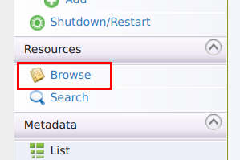
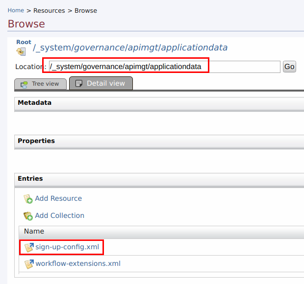
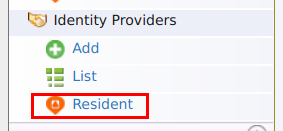
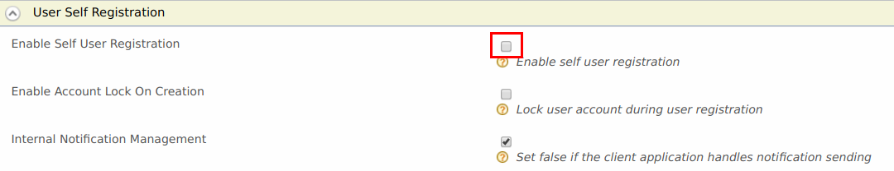
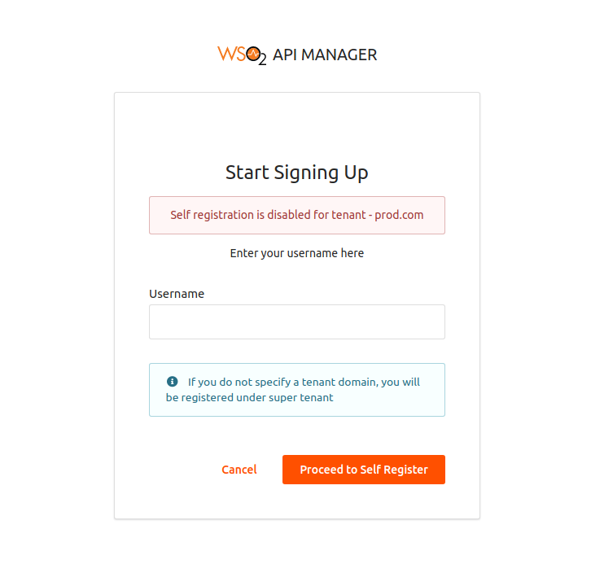

# Enabling or Disabling Self Signup

#### Enabling self signup

In a multi-tenanted API Manager setup, self signup to the Developer Portal works out-of-the-box for super tenant(`carbon.super`). **But in order to make it work for tenants the following steps should be carried out**.

1. Sign in to the management console ( `https://<HostName>:9443/carbon` ) as tenant admin.

2.  Go to the **Resources &gt; Browse** menu.

    

3.  Navigate to the `/_system/governance/apimgt/applicationdata/` directory.

4.  Click on `sign-up-config.xml` to load the resource in the registry browser UI and select the **Edit as text** option to edit the configurations.

        

5.  Do the following change in the signup configuration and save.

    -   Set `<EnableSignup>` to true.
    -   Set `<AdminUserName>` and `<AdminPassword>` to the credentials of the tenant admin.

    ```xml
    <SelfSignUp>

        <EnableSignup>true</EnableSignup>

        <!-- user storage to store users -->
        <SignUpDomain>PRIMARY</SignUpDomain>

        <!-- Tenant admin information. (for clustered setup credentials for AuthManager) -->
        <AdminUserName>xxxx</AdminUserName>
        <AdminPassword>xxxx</AdminPassword>

        <!-- List of roles for the tenant user -->
        <SignUpRoles>
            <SignUpRole>
                <RoleName>subscriber</RoleName>
                <IsExternalRole>false</IsExternalRole>
            </SignUpRole>
        </SignUpRoles>
    </SelfSignUp>
    ```

#### Disabling self signup

In order to disable self signup for a particular tenant, follow the steps below.

1. Sign in to the management console ( `https://<HostName>:9443/carbon` ) as tenant admin.

2. Navigate to the `/_system/governance/apimgt/applicationdata/sign-up-config.xml` file in the registry again and set the `<SelfSignUp><EnableSignup>` element to false and save the content.

3. Click **Resident** under **Identity Providers** on the **Main** tab and expand the **Account Management Policies** tab.

    

    

4. Expand the **User Self Registration** tab and uncheck the **Enable Self User Registration** property and update the content.

    

5. When trying to register as a new user on the particular tenant domain, you will see the following message notifying that self registration is disabled.

    

!!! tip
    To engage your own signup process, see [Adding a User Signup Workflow]({{base_path}}/develop/customizations/adding-a-user-signup-workflow).
