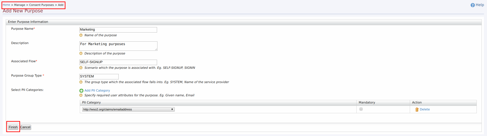
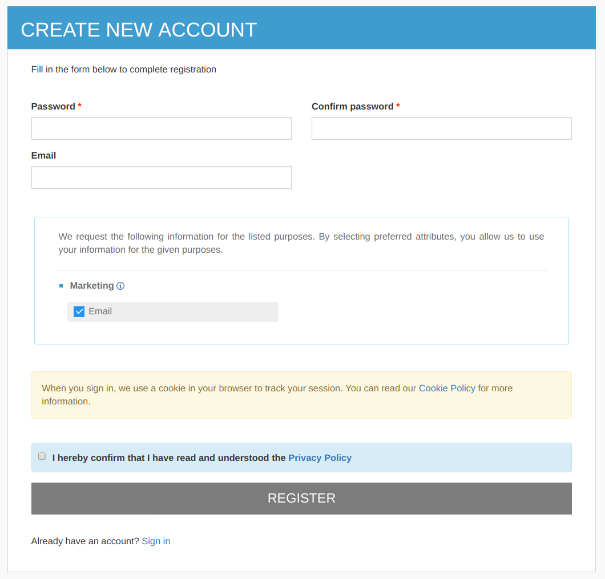

# Customizing User Signup in Developer Portal

WSO2 API Manager (WSO2 API-M) allows new users to gain access to the Developer Portal via a Self sign-up page. The default sign-up page has a set of mandatory and optional fields where the user can use to provide their details. However, there can be cases where Developer Portal owners need to customize the available fields by modifying the available fields or/and adding new fields.

This customization can be easily achieved in WSO2 API Manager because the fields are loaded dynamically from the user claim attributes. The fields that are available in the sign-up page together with instructions on how to customize the default sign-up page are explained as follows.

#### User sign-up page

By default, the Developer Portal sign-up page looks as follows:

It has following fields by default.

| Mandatory Fields | Optional Fields              |
|------------------|------------------------------|
| First Name       | Organization                 |
| Last Name        | Telephone                    |
| Password         | IM                           |
| Confirm Password | Country                      |
| Email            | Mobile                       |
|                  | URL                          |

#### Adding a new field to the user sign-up form

If you want to add a new field to the Developer Portal sign-up page that will be filled up when a new user signs up to the Developer Portal, you can do this by adding a local claim via the WSO2 API-M Management Console.

Let's add a field named **City** by following the instructions below:

1.  Start the WSO2 API Manager server, and go to the WSO2 API-M Management Console ( <https://localhost:9443/carbon/> )
2.  Navigate to the **Main** menu and click **Add** which is under the **Claims** tab.
3.  Click **Add Local Claim** .
    
4.  Enter the following values as the local claim details.

    |                      |                               |
    |----------------------|-------------------------------|
    | Claim URI            | <http://wso2.org/claims/city> |
    | Display Name         | City                          |
    | Description          | City                          |
    | Mapped Attribute     | city                          |
    | Supported By Default | select                        |

    

    

        
Info

        
The **claims** which are **Supported by Default** , are only displayed in the sign-up page. Therefore, when you are adding new claims make sure to select the **Supported by Default** check box.

    

5.  If you need to define this claim as a required field (Mandatory field in sign-up), make sure to check the **Required** check box.
6.  Click **Add** .
7.  Navigate to Developer Portal sign-up page and refresh it.
    You should see the newly added field.
    

#### Modifying existing fields in the user sign-up form

You can modify the fields of the user sign-up page by editing the existing claims mapped to the respective fields.

Let's make the field named **City** a mandatory field and also change the display order of the field by following the instructions below:

1.  Start the WSO2 API Manager server and navigate to WSO2 API-M Management Console (<https://localhost:9443/carbon/>).
2.  Navigate to the **Main** menu and click **List** which is under the **Claims** tab.
3.  Click <http://wso2.org/claims> in the list of claims that appear.
    
4.  Edit the respective claim.
    1.  Click on the **Edit** link that corresponds to the **City** claim.
        
    2.  Select the **Required** check box and save changes.
        
5.  Navigate to Develper Portal Sign-up page and refresh it.
    You will see that the **City** field is marked as mandatory.
    

Similarly, you can modify the other existing fields in the user sign-up page by editing the claims based on your requirement.

#### Adding consent purposes

WSO2 API-M allows you to specify different consent purposes for collecting Personally Identifiable Information (PII) from users who sign up to the Developer Portal. For example, the email address or the telephone number can be used for marketing purposes.

Follow the steps below to add consent purposes.

1.  Start the WSO2 API Manager server and navigate to WSO2 API-M Management Console (<https://localhost:9443/carbon/>).
2.  Navigate to the **Main** tab. Select **Consent Purposes** , which is under the **Manage** tab, and click **Add**.
3.  Fill in the details of the PII categories as shown below.
    
4.  Click **Finish** .

If a specific tenant admin has previously specified consent purposes via the WSO2 API-M Management Console, during the sign-up process, the list of those consent purposes will be shown to the respective users who belong to the same tenant domain in order to obtain their consent.

